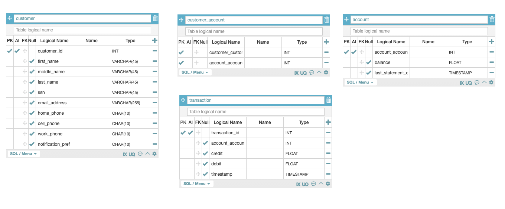

# 3장 예제 잡 애플리케이션

## 스프링 배치의 주요 개념
- 다양한 입/출력 방식
  - 다양한 소스로 부터 입/출력을 처리하는 잘 추상화된 입출력 기능
  - 다양힌 Reader/Writer 를 제공한다.
- 오류 처리
  - 배처 처리중 최악의 상황은 배치처리 중 오류가 발생하는 것
  - 로깅 / 오류가 존재하는 레코드 스킵 / 재시도하기 등을 제공한다.
- 확장성
  - 많은 양의 데이터를 처리할 수 있어야 한다.

## 애자일 개발의 이해
- 애자일 프로세스와 그의 변형은 다음 12가지 테넌트를 가지고 있다.

1. 고객 만족은 동작하는 소프트웨어를 고객에세 빠르게 전달함으로 써 얻어진다.
2. 개발 단계에 관계없이 변형을 환영하라.
3. 동작하는 소프트웨어를 자주 배포하라.
4. 비즈니스 담당자와 개발자는 매일 함께 일해야 하낟.
5. 동기가 부여된 구성원으로 프로젝트를 구성하라. 구성원에게 필요한 도구를 제공하고 작업을 완수할 것이라고 믿어라.
6. 얼굴을 맞대고 이뤄지는 의사 교환이 가장 효과적이다.
7. 동작하는 소프트웨어가 진척도의 가장 중요한 척도다.
8. 지속 가능한 개발을 장려하라, 팀원 전원이 개발속도를 꾸준하게 유지할 수 있어야 한다.
9. 우수한 기술력과 좋은 설계 능력을 갖추도록 지속적으로 노력하라.
10. 불필요한 작업을 없애 낭비를 최소화하라.
11. 자기 조직화 된 팀이 최고의 요구사항, 아키텍쳐, 설계를 만들어낸다.
12. 팀은 정기적으로 어떻게 개선할지 결정하고 이를 반영한다.

### 사용자 스토리로 요구사항 포착
- 사용자 스토리는 요구사항을 문서화하는 방법이다. 세 가지 주요 부분은 다음과 같다.
1. 제목
   - 스토리의 내용과 관련된 단순하고 간결해야 한다
   - ex) 거래 파일 내 정보를 적재한다, 인쇄 파일을 생성한다.
2. 내러티브 (narrative)
   - 사용자스토리로 문서화하려는 상호작용을 사용자 관점에서 간단히 설명한 것
   - ex) Y 상황에서, X 가 무언가를 수행하고, 어떤 다른일이 발생한다.
3. 인수 기준 (acceptance criteria)
   - 스토리 완료여부를 판단할 때 사용할 수 있는 **테스트 가능** 한 요구사항
   - 어떤 방식으로든 검증할 수 있어야한다.

`범용 리모컨으로 살펴보는 사용자 스토리`
- 제목 : 텔레비전 켜기
- 내러티브 : 사용자는 텔레비전, 수신기, 케이블 박스를 끈 상태에서 범용 리코먼의 전원 버튼을 누를 수 있다.
  - 그러면 리모콘은 텔레비전, 수신기, 케이블 박스의 전원을 켜고 텔레비전 쇼를 보도록 구성한다.
- 인수 기준 :
  - 범용 리모컨에 전원 버튼이 있다.
  - 사용자가 전원 버튼을 누르면 다음과 같이 동작한다.
    1. 텔레비전 전원이 켜진다.
    2. AV 수신기 전원이 켜진다.
    3. 케이블 박스 전원이 켜진다.
    4. 케이블 박스는 187 채널로 설정될 것이다.
    5. AV 수신기는 SAT 입력으로 설정될 것이다.
    6. TV 는 비디오 1 입력으로 설정될 것이다.

`사용자 스토리와 유스케이스의 차이`
- 유스케이스는 익숙한 형태의 요구사항 문서이며 사용자 스토리와 유사하게 행위자 중심이다.
- 행위자와 시스템 간의 상호작용의 모든 측면을 문서화할 때 사용한다.
- 때문에 지나치게 문서 중심적이고 포맷도 비대해져 애자일에서는 사용자 스토리를 사용한다.

### 테스트 주도 개발로 설계
- TDD 는 또 다른 애자일 실천 방식
- 개발자는 실패하는 테스트를 먼저 작성한 후 코드를 구현해 테스트를 통과 시킨다.
- TDD 는 개발자들이 코드 작성 전, 무엇을 코드화 하려는지 생각하도록 하는것이 목적
- 또한 테스트가 실행가능한 문서 역할을 한다.

## 은행 거래명세서 잡의 요구사항 이해
- 온라인으로 확인가능한 월별 은행 거래명세서이다.
- 배치 처리가 수행해야하는 기능 전체는 다음과 같다.
  1. 제공된 입력 파일 기반으로 고객 정보 갱신
  2. 데이터베이스에 저장된 모든 고객의 거래 정보 가져오기
  3. 계좌 잔액으로 계좌 정보 갱신
  4. 지난 한달 동안의 은행 계좌 파일 인쇄

`1. 제공된 입력 파일 기반으로 고객 정보 갱신`
- 고객정보가 담긴 파일을 잡에 제공
- 고객 정보가 변경되었을 수 있기 때문에 파일을 읽어 데이터베이스에 기존 고객 데이터를 갱신한다.
- 인수 기준 :
  - 배치 잡은 CSV 기반 고객정보 갱신 파일을 읽는다.
  - 유형에 맞게 고객 레코드 개신이 이루어진다.
    - 레코드 유형 1은 이름 변경을 나타낸다.
    - 레코드 유형 2는 메일 주소 변경을 나타낸다.
    - 레코드 유형 3은 연락처 정보 변경을 나타낸다.


* 유형 1

| 항목 명 | 필수 여부 | 포맷 |
| --- | --- | --- |
| 레코드 타입 아이디 | true | \d |
| 고객 아이디 | true | \d{9} |
| 고객 이름 First Name | false | \w+ |
| 고객 중간 이름 Middle Name | false | \w+ |
| 고객 성 Last Name | false | \w+ |

ex) 1, 123456789, John, Middle, Doe

* 유형 2

| 항목 명 | 필수 여부 | 포맷 |
| --- | --- | --- |
| 레코드 타입 아이디 | true | \d |
| 고객 아이디 | true | \d{9} |
| 주소 1 | false | \w+ |
| 주소 2 | false | \w+ |
| 도시 | false | \w+ |
| 주 | false | \w{2} |
| 우편번호 | false | \d{5} |

ex) 2, 123456789, 123, 4th Street Unit 5, Chicago, IL, 60606

* 유형 3

| 항목 명 | 필수 여부 | 포맷 |
| --- | --- | --- |
| 레코드 타입 아이디 | true | \d |
| 고객 아이디 | true | \d{9} |
| 이메일 주소 | false | \w+ |
| 집 전화번호 | false | \d{3}-\d{3}-\d{4} |
| 휴대전화번호 | false | \d{3}-\d{3}-\d{4} |
| 사무실 전화번호 | false | \d{3}-\d{3}-\d{4} |
| 알림 기본 설정 | false | \d |

ex) 3, 123456789, foo@bar.com, 123-456-7890, 123-456-7890, 123-456-7890, 2

> 유효성 검증 오류가 있는 레코드는, 유효성 검증 및 재처리를 위한 오류 파일에 기록되어야 한다.

`2. 데이터베이스에 저장된 모든 고객의 거래 정보 가져오기`
- 모든 고객의 거래 정보를 가져온다.
- 거래 정보 데이터는 XML 로 제공되며, 기존 데이터베이스에 추가 저장할 것이다.
- 인수 기준 :
  - 처리시 XML 파일로 작성된 거래 정보를 읽는다.
  - 각 거래 정보는 거래 테이블에 새 레코드로 생성된다.
  - 파일의 각 레코드에는 다음과 같은 필드가 있다.

| 항목 명 | 필수 여부 | 포맷 |
| --- | --- | --- |
| 거래 아이디 | true | \d{9} |
| 계좌 아이디 | true | \d{9} |
| 입금 | false | \d+\.\d{2} |
| 출금 | false | \d+\.\d{2} |
| 타임스탬프 | false | yyyy-MM-dd HH:mm:ss.ssss |

```xml
<transactions>
  <transaction>
    <transactionId>123456789</transactionId>
    <accountId>987654321</accountId>
    <description>Paycheck</description>
    <credit>500.00</credit>
    <debit/>
    <timestamp>2017-07-20 15:38:57.480</timestamp>
  </transaction>
</transactions>
```

`3. 계좌 잔액으로 계좌 정보 갱신`
- 고객의 현재 잔액을 기록하는 테이블을 갱신한다.
- 잔액 정보를 사용해서 현재잔액을 알고 싶을때 다시 계산할 필요가 없어진다.
- 계좌테이블 에는 잔액 필드가 있으며, 가장 최근에 가져온 모든 거래 정보를 사용해 갱신한다.

`4. 거래명세서 헤더 인쇄`
- 배치 처리로 각 상단의 헤더를 인쇄한다.
- 헤더는 고객 및 은행의 일반적인 정보를 보여준다.
- 인수 기준 :
  - 헤더는 고객 이름과 주소를 제외하고는 정적인 문자열이다.

`5. 계좌 요약 정보 인쇄하기`
- 모든 계산이 완료된 이후 배치 처리로 고객별 계좌 요약 정보를 인쇄한다.
- 이는 고객 계좌의 개요를 보여준 뒤 해당 계좌의 총 금액을 구성하는 내역 목록을 보여준다.
  - 처리가 이뤄진 후 고객별로 파일이 하나씩 생성된다.

## 배치 잡 설계
- 앞선 예제가 다소 복잡해 보이지만 스프링 배치가 제공하는 기능들을 이용해 충분히 처리가 가능하다.

`잡 처리 흐름`
- 거래명세서 생성 배치를 위한 4개의 스텝으로 구성된 잡을 생성한다.

```text
[고객 데이터 가져오기] -> [거래정보 가져오기] -> [현재 잔액 계산하기] -> [월별 고객 거래명세서 생성하기]
```

### 데이터 모델 이해
- Customer, Account, Transaction, CustomerAccount 라는 4개의 테이블로 구성되어 있다.


