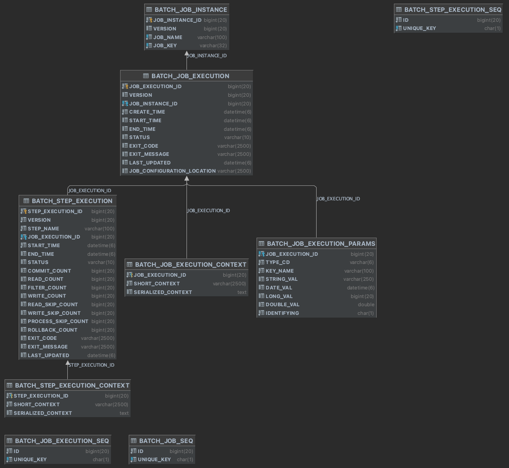
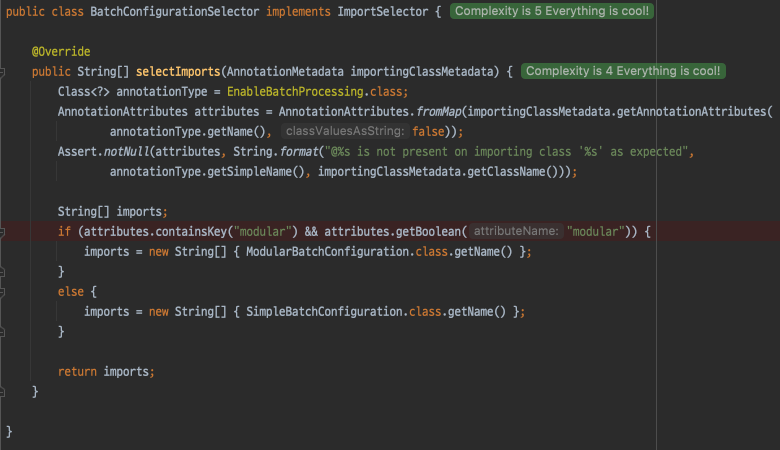
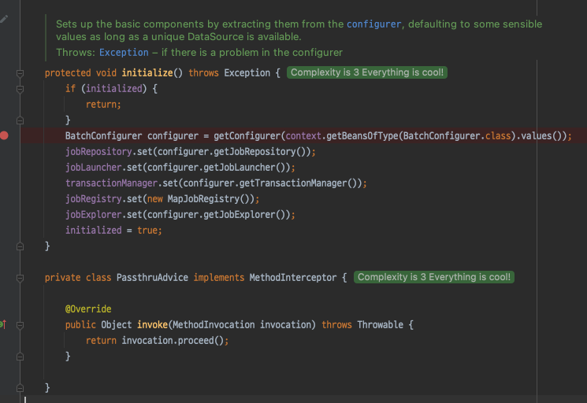

# 5장 JobRepository 와 메타데이터
- 스프링 부트가 제공하는 **CommandLineRunner** 를 사용하면 단일 기능을 실행한 뒤 정상종료되는 스프링 부트 애플리케이션 개발이 가능하다.
- 이런 정도 수준에는 스프링 배치는 필요하지 않다.
- 스프링 배치가 제공하는 주요기능 중 하나는, **잡의 상태 관리 기능** 이다.
- JobRepository 에 잡의 상태를 저장해 관리하고, 재시작 또는 재처리시 어떤 동작을 수행할지 이를 기반으로 결정한다.
- 또 다른 기능은 **모니터링** 이다. 잡이 처리되는데 걸린 시간, 오류 관련 정보 등 어디까지 실행되었는가에 대한 정보는 엔터프라이즈 환경에서 매우 중요하다.

## JobRepository
- 스프링 배치내에서 JobRepository 는 다음 둘 중 하나를 의미한다.
  - JobRepository 인터페이스
  - JobRepository 인터페이스를 구현해 데이터 저장시 사용되는 저장소
- 스프링 배치는 배치 잡 내에서 사용가능한 두 가지 저장소 (인메모리, 관계형) 을 제공한다.

### 관계형 데이터베이스
- 스프링 배치에서 기본적으로 사용되는 JobRepository 
- 스프링배치가 사용하는 여러 데이터베이스 테이블을 사용해 배치 메타데이터를 저장한다.



- JobRepository 에는 6개의 테이블이 존재한다. (SEQ 테이블을 제외한 수)
  - BATCH_JOB_INSTANCE
  - BATCH_JOB_EXECUTION
  - BATCH_JOB_EXECUTION_PARAMS
  - BATCH_JOB_EXECUTION_CONTEXT
  - BATCH_STEP_EXECUTION
  - BATCH_STEP_EXECUTION_CONTEXT

`BATCH_JOB_INSTANCE`
- 실질적인 시작점은 **BATCH_JOB_INSTANCE** 이다.
- 잡을 식별하는 정보 (잡네임 / 잡파라미터) 를 기반으로 JobInstance 레코드가 등록된다.
- 이는 **잡의 논리적인 실행** 을 의미한다.

| 필드 | 설명 |
| --- | --- |
| JOB_EXECUTION_ID | 테이블의 기본 키 |
| VERSION | 낙관적 락에 사용되는 버전 |
| JOB_NAME | 잡의 이름 |
| JOB_KEY | 잡의 이름과 파라미터의 해시값 JobInstance 를 식별하는 고유값 |

`BATCH_JOB_EXECUTION`
- 배치 잡의 **실제 실행 기록** 을 의미
- 잡 실행시마다 새 레코드가 등록되며, 잡이 진행되는 동안 주기적으로 업데이트 된다.

| 필드 | 설명 |
| --- | --- |
| JOB_EXECUTION_ID | 테이블의 기본 키 |
| VERSION | 낙관적 락에 사용되는 레코드 버전 |
| JOB_INSTANCE_ID | BATCH_JOB_INSTANCE 테이블을 참조하는 외래 키 |
| CREATE_TIME | 레코드가 생성된 시간 |
| START_TIME | 잡 실행이 시작된 시간 |
| END_TIME | 잡 실행이 완료된 시간 |
| STATUS | 잡 실행의 배치 상태 |
| EXIT_CODE | 잡 실행의 종료 코드 |
| EXIT_MESSAGE | EXIT_CODE 와 관련된 메세지나 스택 트레이스 |
| LAST_UPDATED | 레코드가 마지막으로 갱신된 시간 |

`BATCH_JOB_EXECUTION_CONTEXT`
- ExecutionContext 가 재시작 처럼 배치가 여러번 실행되는 상황에서 관련 정보를 보관하기 위한 테이블이다.
- ExecutionContext 가 직렬화 되어 저장된다.
- 이를 직렬화 하는 방법으로 몇가지가 제공되는데, 스프링 배치 4버전 이전에는 XStream 의 JSON 기능을 사용해 기본적으로 사용했었다.
- 하지만 스프링배치 4 이후부터 XStream 의 JSON 기능이 충분히 지원해주지 못해 Jackson2 를 기본적으로 사용하도록 변경되었다.

| 필드 | 설명 |
| --- | --- |
| JOB_EXECUTION_ID | 테이블의 기본 키 |
| SHORT_CONTEXT | 트림 처리된 SERIALIZED_CONTEXT |
| SERIALIZED_CONTEXT | 직렬화된 ExecutionContext |

`BATCH_JOB_EXECUTION_PARAMS`
- 잡이 매번 실행될 때 마다 사용된 **잡 파라미터** 를 저장한다.
- 실제로 잡 실행시 모든 파라미터가 테이블에 저장되며, 재시작 시에는 잡의 식별 정보 파라미터만 전달되는 방식이다.

| 필드 | 설명 |
| --- | --- |
| JOB_EXECUTION_ID | 테이블의 기본 키 |
| TYPE_CODE | 파라미터 값의 타입을 나타내는 문자열 |
| KEY_NAME | 파라미터의 이름 |
| STRING_VAL | 타입이 String 인 파라미터의 값 |
| DATE_VAL | 타입이 Date 인 파라미터의 값 |
| LONG_VAL | 타입이 Long 인 파라미터의 값 |
| DOUBLE_VAL | 타입이 Double 인 파라미터의 값 |
| IDENTIFYING | 파라미터가 잡 식별자로 사용되는지 여부 |

`BATCH_STEP_EXECUTION`
- 잡관련 테이블과 유사하게 스탭 관련 정보를 저장한다.
- 이는 스탭의 시작, 완료 상태에 대한 메타데이터와 스탭 분석이 가능 하도록 다양한 횟수 값이 추가로 저장 된다.

| 필드 | 설명 |
| --- | --- |
| JOB_EXECUTION_ID | 테이블의 기본 키 |
| VERSION | 낙관적 락에 사용되는 레코드 버전 |
| JOB_INSTANCE_ID | BATCH_JOB_INSTANCE 테이블을 참조하는 외래 키 |
| CREATE_TIME | 레코드가 생성된 시간 |
| START_TIME | 잡 실행이 시작된 시간 |
| END_TIME | 잡 실행이 완료된 시간 |
| STATUS | 잡 실행의 배치 상태 |
| COMMIT_COUNT | 스탭 실행 중에 커밋된 트랜잭션 수 |
| READ_COUNT | 읽은 아이템 수 |
| FILTER_COUNT | 아이템 프로세서가 null 을 반환해 필터된 아이템 수 |
| WRITE_COUNT | 기록된 아이템 수 |
| READ_SKIP_COUNT | ItemReader 내에서 예외가 던져졌을 때 건너뛴 아이템 수 |
| PROCESS_SKIP_COUNT | ItemProcessor 내에서 예외가 던져졌을 때 건너뛴 아이템 수 |
| WRITE_SKIP_COUNT | ItemWriter 내에서 예외가 던져졌을 때 건너뛴 아이템 수 |
| ROLLBACK_COUNT | 스탭 실행에서 롤백된 트랜잭션 수 |
| EXIT_CODE | 잡 실행의 종료 코드 |
| EXIT_MESSAGE | EXIT_CODE 와 관련된 메세지나 스택 트레이스 |
| LAST_UPDATED | 레코드가 마지막으로 갱신된 시간 |

`BATCH_STEP_EXECUTION_CONTEXT`
- 잡의 ExecutionContext 를 저장하기 위한 테이블이 존재하는것 처럼 이 또한 스탭의 ExecutionContext 를 저장하기 위한 목적으로 사용된다. 

| 필드 | 설명 |
| --- | --- |
| JOB_EXECUTION_ID | 테이블의 기본 키 |
| SHORT_CONTEXT | 트림 처리된 SERIALIZED_CONTEXT |
| SERIALIZED_CONTEXT | 직렬화된 ExecutionContext |

### 인메모리 데이터베이스
- 스프링 배치잡을 개발 또는 단위 테스트 수행시 사용할 인메모리 저장소 구현체를 제공한다.
  - java.util.Map 구현체를 사용
- Map 기반의 저장소는 실제 운영시엔 사용하지 않으며, H2 / HSQLDB 와 같은 인메모리 데이터베이스를 사용한다.

## 배치 인프라스트럭쳐 구성하기
- @EnableBatchProcessing 애노테이션을 사용하면 스프링 배치가 제공하는 설정들에 의해 JobRepository 를 사용할 수 있다.
- 커스터마이징이 필요한 경우 BatchConfigurer 인터페이스를 사용해 이를 변경할 수 있다.

### BatchConfigurer
- 스프링 배치 인프라스트럭쳐 구성을 커스터마이징 하기 위한 용도의 **전략 인터페이스** 이다.
- @EnableBatchProcessing 애노테이션을 적용하면, BatchConfigurer 인터페이스의 구현체들에 대한 인스턴스를 얻어 각 설정을 수행한다.
  - 이 설정이 수행되는 단계는 크게 3 단계로 나뉜다.
  1. BatchConfigurationSelector 클래스에서 Modular 설정이 필요한지 유무에 따라 **ModularBatchConfiguration** 또는 **SimpleBatchConfiguration** 중 하나를 선택한다.
  2. BatchConfigurer 의 구현체를 빈으로 등록한다. (스프링 부트 기준 BatchAutoConfiguration > BatchConfigurerConfiguration 순으로 동작하며 구현체가 등록된다.)
  3. '1' 서 선택된 설정파일에서, '2' 에 등록된 구현체를 기반으로 스프링배치 설정을 수행한다.





> 일반적인 경우 SimpleBatchConfiguration 와 같은 설정 클래스를 수정할 일은 없고, 커스터마이징이 필요한 경우 BatchConfigurer 를 사용해 커스터마이징을 수행한다.

`BatchConfigurer`

```java
public interface BatchConfigurer {
    JobRepository getJobRepository() throws Exception;

    PlatformTransactionManager getTransactionManager() throws Exception;

    JobLauncher getJobLauncher() throws Exception;

    JobExplorer getJobExplorer() throws Exception;
}
```

> 일반적인 경우 BatchConfigurer 인터페이스를 직접 구현해서 커스터마이징 하는 경우는 잘 없고, DefaultBatchConfigurer 를 이용해 필요한 부분만 오버라이딩 하는 방식을 취한다.

`DefaultBatchConfigurer`

```java
@Component
public class DefaultBatchConfigurer implements BatchConfigurer {
	private static final Log logger = LogFactory.getLog(DefaultBatchConfigurer.class);

	private DataSource dataSource;
	private PlatformTransactionManager transactionManager;
	private JobRepository jobRepository;
	private JobLauncher jobLauncher;
	private JobExplorer jobExplorer;

	/**
	 * Sets the dataSource.  If the {@link DataSource} has been set once, all future
	 * values are passed are ignored (to prevent {@code}@Autowired{@code} from overwriting
	 * the value).
	 *
	 * @param dataSource The data source to use
	 */
	@Autowired(required = false)
	public void setDataSource(DataSource dataSource) {
		if(this.dataSource == null) {
			this.dataSource = dataSource;
		}

		if(getTransactionManager() == null) {
			logger.warn("No transaction manager was provided, using a DataSourceTransactionManager");
			this.transactionManager = new DataSourceTransactionManager(this.dataSource);
		}
	}

	protected DefaultBatchConfigurer() {}

	public DefaultBatchConfigurer(DataSource dataSource) {
		setDataSource(dataSource);
	}

	@Override
	public JobRepository getJobRepository() {
		return jobRepository;
	}

	@Override
	public PlatformTransactionManager getTransactionManager() {
		return transactionManager;
	}

	@Override
	public JobLauncher getJobLauncher() {
		return jobLauncher;
	}

	@Override
	public JobExplorer getJobExplorer() {
		return jobExplorer;
	}

	@PostConstruct
	public void initialize() {
		try {
			if(dataSource == null) {
				logger.warn("No datasource was provided...using a Map based JobRepository");

				if(getTransactionManager() == null) {
					logger.warn("No transaction manager was provided, using a ResourcelessTransactionManager");
					this.transactionManager = new ResourcelessTransactionManager();
				}

				MapJobRepositoryFactoryBean jobRepositoryFactory = new MapJobRepositoryFactoryBean(getTransactionManager());
				jobRepositoryFactory.afterPropertiesSet();
				this.jobRepository = jobRepositoryFactory.getObject();

				MapJobExplorerFactoryBean jobExplorerFactory = new MapJobExplorerFactoryBean(jobRepositoryFactory);
				jobExplorerFactory.afterPropertiesSet();
				this.jobExplorer = jobExplorerFactory.getObject();
			} else {
				this.jobRepository = createJobRepository();
				this.jobExplorer = createJobExplorer();
			}

			this.jobLauncher = createJobLauncher();
		} catch (Exception e) {
			throw new BatchConfigurationException(e);
		}
	}

	protected JobLauncher createJobLauncher() throws Exception {
		SimpleJobLauncher jobLauncher = new SimpleJobLauncher();
		jobLauncher.setJobRepository(jobRepository);
		jobLauncher.afterPropertiesSet();
		return jobLauncher;
	}

	protected JobRepository createJobRepository() throws Exception {
		JobRepositoryFactoryBean factory = new JobRepositoryFactoryBean();
		factory.setDataSource(dataSource);
		factory.setTransactionManager(getTransactionManager());
		factory.afterPropertiesSet();
		return factory.getObject();
	}

	protected JobExplorer createJobExplorer() throws Exception {
		JobExplorerFactoryBean jobExplorerFactoryBean = new JobExplorerFactoryBean();
		jobExplorerFactoryBean.setDataSource(this.dataSource);
		jobExplorerFactoryBean.afterPropertiesSet();
		return jobExplorerFactoryBean.getObject();
	}
}
```

### JobRepository 커스터마이징
- JobRepository 는 **JobRepositoryFactoryBean** 을 통해 생성된다.
- 이 클래스를 통해 커스터마이징을 수행 할 수 있다.

| 접근자 이름 | 설명 |
| --- | --- |
| setClobType | CLOB 컬럼에 사용할 타입을 나타내는 java.sql.Type 인자를 받음 |
| setSerializer | ExecutionContext 를 직렬화할 때 사용할 **ExecutionContextSerializer* 의 구현체를 인자로 받음 |
| setLobHandler | LOB 를 다르게 취급해야하는 Oracle 의 예전 버전 사용시 필요한 설정 |
| setMaxVarCharLength | ShortContext 컬럼 / ExitMessage 컬럼의 길이 지정시 사용한다. 스프링배치 스키마 변경을 하지 않는한 사용해선 안됨 |
| setDataSource | DataSource 변경 설정 |
| setJdbcOperations | JdbcOperations 인스턴스 변경 설정 |
| setDatabaseType | 데이터베이스 유형 설정 / 스프링배치는 자동식별 기능을 제공 |
| setTablePrefix | "BATCH_" prefix 를 변경 |
| setIncrementorFactory | 테이블의 기본키 증분시 사용하는 팩토리 지정 |
| setValidateTransactionState | JobExecution 생성시 기존트랜잭션 존재 여부 설정 / 기본값 true |
| setIsolationLevelForCreate | JobExecution 생성시 사용될 트랜잭션 격리 수준 / 기본은 SERIALIZABLE |
| setTransactionManager | 복수의 데이터베이스 사용시 이를 동기화할 수 있도록 2단계 커밋을 지원하는 트랜잭션 매니저 설정 |

## 참고
- https://kwonnam.pe.kr/wiki/springframework/batch