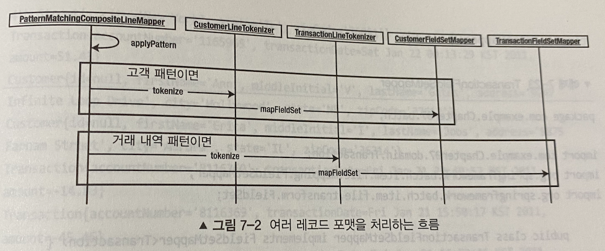

# 7장 ItemReader
- 스프링배치에서 청크기반 으로 동작하는 각 스텝은, ItemReader / ItemProcessor / ItemWriter 로 구성된다.
- 시스템에서 데이터를 읽는 작업이 항상 명확한 것은 아니다.
- 제공되는 데이터의 유형은 다양하다.
- 스프링 배치는 거의 모든유형의 입력 데이터를 처리할 수 있는 표준 방법을 제공한다.
  - 스프링 배치가 지원하지 않는 포맷의 데이터를 처리할 수 있는 커스텀 리더를 개발하는 기능도 제공한다.

## ItemReader 인터페이스
- ItemReader 인터페이스는 단순히 read() 메소드 하나만을 정의하고 있는 **전략 인터페이스** 이다.
- 스프링 배치는 처리할 입력 유형에 맞는 여러 구현체를 제공한다.
  - 다양한 데이터베이스
  - JMS
  - 다양한 파일 포맷
  - 기타 입력 소스 등..
- 기본 제공 구현체들 외에도 ItemReader 인터페이스를 구현해 커스텀 ItemReader 를 만들 수도 있다.
- 스프링 배치가 read() 메소드를 호출하면 스탭에서 처리할 아이템 **한 개를 반환** 한다.
  - read 가 반환한 아이템이 컬렉션이라면, 해당 컬렉션을 하나의 아이템으로 취급한다.
- 스탭에서는 아이템 갯수를 세어 Chunk 단위로 관리하고, 해당 아이템은 ItemProcessor -> ItemWriter 순으로 전달된다.

`org.springframework.batch.item.ItemReader`

```java
public interface ItemReader<T> {

	/**
	 * Reads a piece of input data and advance to the next one. Implementations
	 * <strong>must</strong> return <code>null</code> at the end of the input
	 * data set. In a transactional setting, caller might get the same item
	 * twice from successive calls (or otherwise), if the first call was in a
	 * transaction that rolled back.
	 * 
	 * @throws ParseException if there is a problem parsing the current record
	 * (but the next one may still be valid)
	 * @throws NonTransientResourceException if there is a fatal exception in
	 * the underlying resource. After throwing this exception implementations
	 * should endeavour to return null from subsequent calls to read.
	 * @throws UnexpectedInputException if there is an uncategorised problem
	 * with the input data. Assume potentially transient, so subsequent calls to
	 * read might succeed.
	 * @throws Exception if an there is a non-specific error.
	 * @return T the item to be processed or {@code null} if the data source is
	 * exhausted
	 */
	@Nullable
	T read() throws Exception, UnexpectedInputException, ParseException, NonTransientResourceException;

}
```

`javax.batch.api.chunk.ItemReader`

```java
public interface ItemReader {
    void open(Serializable var1) throws Exception;

    void close() throws Exception;

    Object readItem() throws Exception;

    Serializable checkpointInfo() throws Exception;
}
```

> 스프링 배치가 제공하는 ItemReader 인터페이스는 JSR-352(JBatch) 에 정의된 javax.batch.api.chunk.ItemReader 와는 다르다. <br/>
> 두 인터페이스의 차이점은 스프링 배치는 일반적인 입력 지원을 제공하지만, JSR 은 ItemReader 와 ItemStream 인터페이스를 조합한다.

## 다양한 파일 입력

### 플랫 파일
- **플랫 파일 (flat file)** 이란, 한 개 또는 그이상의 레코드가 포함된 특정한 파일을 지칭한다.
- 플랫 파일은 파일의 내용을 보아도 데이터의 의미를 알 수 없다는 점에서 XML 파일과 비교된다.
  - 메타데이터가 존재하지 않는다.

`FlatFileItemReader`
- 플랫파일을 처리하는 ItemReader
- 두 개의 메인 컴포넌트로 구성되어 있다.
  - org.springframework.core.io.Resource
  - org.springframework.batch.item.file.LineMapper
- LineMapper 는 JDBC 의 RowMapper 와 같은 역할을 수행한다.
  - LineMapper 의 구현체는 DefaultLineMapper

| 옵션 | 타입 | 기본값 | 설명 |
| --- | --- | --- | --- |
| comments | String[] | null | 파일 파싱시 건너 뛰어야할 주석 줄을 나타내는 접두어 지정 |
| encoding | String | 기본 Charset | 파일의 문자열 인코딩 |
| lineMapper | LineMapper | null (필수) | 파일의 한줄을 읽어, 도메인 객체 (아이템) 으로 변환할 매퍼를 지정 |
| linesToSkip | int | 0 | 잡 실행시 ItemReader 가 파일 파싱 전 파일의 시작 부터 몇 줄을 건너 뛸 것인지 지정 |
| recordSeparatorPolicy | RecordSeparatorPolicy | DefaultRecordSeparatorPolicy | 각 줄의 마지막 정의시 사용 <br/> 지정하지 않는다면 개행 문자가 레코드의 끝을 의미 <br/> 여러 줄에 걸쳐 따옴표로 감싸진 구문 다룰시 사용도 가능하다. |
| resource | Resource | null (필수) | 읽을 대상 리소스 |
| skippedLinesCallback | LineCallbackHandler | null | 줄을 건너뛸 때 호출될 콜백 인터페이스 |
| strict | boolean | false | true 지정시 리소스를 못찾는 다면 Exception |
| saveState | boolean | true | true 라면 재시작이 가능하도록 청크 처리후 ItemReader 의 상태를 저장 / 멀티스레드 환경이라면 false 로 지정 |
| name | String | null | ExecutionContext 에 저장되는 값의 고유 키를 생성하는데 사용 |
| maxItemCount | int | Integer.MAX_VALUE | 파일에서 읽어들일 아이템의 최대 개수를 나타냄 |
| currentItemCount | int | 0 | 현재 조회중인 아이템의 순번. 재시작 시 사용 |

`DefaultLineMapper`
- LineMapper 의 기본 구현체
- 파일에서 읽은 String 대상으로 **두 단계로 나눠 처리** 한다. (도메인 객체 변환)
- 이 처리는 LineTokenizer , FieldSetMapper 가 각각 수행한다.

```java
public class DefaultLineMapper<T> implements LineMapper<T>, InitializingBean {

	private LineTokenizer tokenizer;

	private FieldSetMapper<T> fieldSetMapper;

    @Override
	public T mapLine(String line, int lineNumber) throws Exception {
		return fieldSetMapper.mapFieldSet(tokenizer.tokenize(line));
	}

	public void setLineTokenizer(LineTokenizer tokenizer) {
		this.tokenizer = tokenizer;
	}

	public void setFieldSetMapper(FieldSetMapper<T> fieldSetMapper) {
		this.fieldSetMapper = fieldSetMapper;
	}

    @Override
	public void afterPropertiesSet() {
		Assert.notNull(tokenizer, "The LineTokenizer must be set");
		Assert.notNull(fieldSetMapper, "The FieldSetMapper must be set");
	}
}
```

`LineTokenizer`
- 각 라인을 의미하는 String 을 인자로 받아, FieldSet 타입을 반환하는 인터페이스
- 레코드 내에 각 필드를 도메인 객체로 매핑하기 전, 해당 줄을 파싱해 각 필드를 의미하는 데이터의 모음으로 변환한다.

```java
public interface LineTokenizer {
	
	/**
	 * Yields the tokens resulting from the splitting of the supplied
	 * <code>line</code>.
	 * 
	 * @param line the line to be tokenized (can be <code>null</code>)
	 * 
	 * @return the resulting tokens
	 */
	FieldSet tokenize(@Nullable String line);
}
```

`FieldSet`
- FieldSet 은 각 라인의 필드 모음을 나타낸다.
- 이는 java.sql.ResultSet 과 유사하다.

```java
public interface FieldSet {

	String[] getNames();
    
	boolean hasNames();
    
	String[] getValues();
    
	String readString(int index);
    
	String readString(String name);
    
	String readRawString(int index);
    
	String readRawString(String name);
    
	boolean readBoolean(int index);
    
	boolean readBoolean(String name);
    
	boolean readBoolean(int index, String trueValue);
    
	boolean readBoolean(String name, String trueValue);
    
	char readChar(int index);
    
	char readChar(String name);
    
	byte readByte(int index);

	byte readByte(String name);

	short readShort(int index);

	short readShort(String name);

	int readInt(int index);

	int readInt(String name);

	int readInt(int index, int defaultValue);

	int readInt(String name, int defaultValue);

	long readLong(int index);

	long readLong(String name);

	long readLong(int index, long defaultValue);

	long readLong(String name, long defaultValue);

	float readFloat(int index);

	float readFloat(String name);

	double readDouble(int index);

	double readDouble(String name);

	BigDecimal readBigDecimal(int index);

	BigDecimal readBigDecimal(String name);

	BigDecimal readBigDecimal(int index, BigDecimal defaultValue);

	BigDecimal readBigDecimal(String name, BigDecimal defaultValue);

	Date readDate(int index);

	Date readDate(String name);

	Date readDate(int index, Date defaultValue);

	Date readDate(String name, Date defaultValue);

	Date readDate(int index, String pattern);

	Date readDate(String name, String pattern);

	Date readDate(int index, String pattern, Date defaultValue);

	Date readDate(String name, String pattern, Date defaultValue);

	int getFieldCount();

	Properties getProperties();
}
```

`FieldSetMapper`
- FieldSet 을 도메인 객체로 매핑한다.
- JDBC RowMapper 가 ResultSet 의 로우를 도메인 객체로 매핑하는것과 유사하다.

```java
public interface FieldSetMapper<T> {
    
	T mapFieldSet(FieldSet fieldSet) throws BindException;
}
```

#### 고정 너비 파일 처리하기

`고객 파일 포맷`

| 필드 | 길이 | 설명 |
| --- | --- | --- |
| FirstName | 11 | 이름 |
| MiddleInitial | 1 | 가운데 이름 첫 글자 |
| AddressNumber | 4 | 주소에서 건물 번호 |
| Street | 20 | 거주하는 거리 이름 |
| City | 16 | 거주 도시 |
| State | 2 | 주의 두 자리 약자 / CA, TX 등 |
| ZipCode | 5 | 우편번호 |

`customer.txt`

```text
Aimee      CHoover    7341Vel Avenue          Mobile          AL35928
Jonas      UGilbert   8852In St.              Saint Paul      MN57321
Regan      MBaxter    4851Nec Av.             Gulfport        MS33193
Octavius   TJohnson   7418Cum Road            Houston         TX51507
Sydnee     NRobinson  894 Ornare. Ave         Olathe          KS25606
Stuart     KMckenzie  5529Orci Av.            Nampa           ID18562
Petra      ZLara      8401Et St.              Georgia         GA70323
Cherokee   TLara      8516Mauris St.          Seattle         WA28720
Athena     YBurt      4951Mollis Rd.          Newark          DE41034
Kaitlin    MMacias    5715Velit St.           Chandler        AZ86176
Leroy      XCherry    7810Vulputate St.       Seattle         WA37703
Connor     WMontoya   4122Mauris Av.          College         AK99743
Byron      XMedina    7875At Road             Rock Springs    WY37733
```

`도메인 클래스`

```java
@Data
public class Customer {
    
    private String middleInitial;
    private String firstName;
    private String lastName;
    private String addressNumber;
    private String street;
    private String city;
    private String state;
    private String zipCode;
}
```

`배치 잡 설정`

```java
@EnableBatchProcessing
@Configuration
public class BatchConfiguration {

    @Autowired
    private JobBuilderFactory jobBuilderFactory;

    @Autowired
    private StepBuilderFactory stepBuilderFactory;

    /**
     * FlatFileItemReader 는 파일의 레코드를 객체로 변환할 때 LineMapper 를 사용한다.
     * DefaultLineMapper 를 기본적으로 많이 사용
     * 아래 설정중 columns, names = LineTokenizer 설정
     * targetType = FieldSetMapper 설정 BeanWrapperFieldSetMapper 를 사용
     * BeanWrapperFieldSetMapper 는 LinkeTokenizer 에 구성된 컬럼명을 이용해 Customer.setFirstName 과 같은 메소드를 호출한다.
     *
     * @FixedLengthTokenizer 는 필드 앞뒤의 0 또는 공백 문자를 제거 하지 않는다.
     */
    @StepScope
    @Bean
    public FlatFileItemReader customerItemReader(
        @Value("#{jobParameters['customerFile']}") Resource inputFile
    ) {
        return new FlatFileItemReaderBuilder<Customer>()
            /**
             * ItemStream 인터페이스는 애플리케이션 내 각 스텝의 ExecutionContext 에추가되는 특정 키의 접두문자로 사용될 이름이 필요하다.
             * 동일한 스탭에서 FlatFileItemReader 두 개를 함께 사용할 때 각 리더의 상태를 저장하는 작업이 서로 영향을 주지 않게 하는데 필요하다. (Reader 의 SaveState = false 일 경우 지정할 필요가 없다)
             */
            .name("customerItemReader")
            .resource(inputFile)
            .fixedLength() // 고정너비 파일 지정 -> FixedLengthTokenizer 를 생성하는 빌더가 반환된다. 이는 각 줄을 파싱해 FieldSet 으로 만드는 LineTokenizer 의 구현체
            .columns(new Range[]{ // Range 객체 배열 지정
                new Range(1, 11), new Range(12, 12), new Range(13, 22),
                new Range(23, 26), new Range(27, 46), new Range(47, 62),
                new Range(63, 64), new Range(65, 69)
            })
            .names("firstName", "middleInitial", "lastName", "addressNumber", "street", "city", "state", "zipCode") // 레코드 내 각 컬럼명을 지정
            .targetType(Customer.class) // BeanWrapperFieldSetMapping 를 생성
            .build();
    }

    /**
     * SimpleWriter
     */
    @Bean
    public ItemWriter itemWriter() {
        return items -> items.forEach(System.out::println);
    }

    @Bean
    public Step copyFileStep() {
        return this.stepBuilderFactory.get("copyFileStep")
            .<Customer, Customer>chunk(10)
            .reader(customerItemReader(null))
            .writer(itemWriter())
            .build();
    }

    @Bean
    public Job job() {
        return this.jobBuilderFactory.get("job")
            .start(copyFileStep())
            .build();
    }
}
```
- name() : 동일한 스탭 내에서 FlatFileItemReader 두 개를 함께 사용할 경우 각 리더의 상태를 저장하는 작업이 서로 영향을 미칠 수 있다.
  - 때문에 이를 구분하기 위해 사용하는데 만약 **saveState 를 false** 로 지정한다면 이름을 설정할 필요가 없다.
    - 잡 재시작시 리더가 맨 처음부터 다시 시작하기 때문
- fixedLength() : 고정너비 파일을 사용하도록 지정한다. -> FixedLengthTokenizer 를 생성하는 빌더가 반환된다.
  - FixedLengthTokenizer 는 각 줄을 파싱해 FieldSet 으로 변환하는 LineTokenizer 의 구현체
- columns() : 각 줄에서 파싱해야할 컬럼의 시작/종료 지점을 Range 배열로 지정한다.
- names() : 레코드의 각 컬럼명을 지정한다.
- targetType : BeanWrapperFieldSetMapper 를 생성

> FixedLengthTokenizer 는 기본적으로 DefaultFieldSetFactory 를 사용하며, strict 옵션을 제공한다. 이는 제공된 파싱 정보보다 더 많은 항목이 포함되어 있다면 예외를 발생시킨다. default : true <br/>
> 또한 각 필드 앞뒤에 붙은 공백이나 0 등의 문자를 제거하지 않는다. 필요시 LineTokenizer 나 FieldSetMapper 를 커스텀해야한다.

#### 필드가 구분자로 구분된 파일 처리하기
- 구분자로 구분된 레코드를 읽는 방법은 고정너비 레코드를 읽는 방법과 거의 유사하다.
- LineTokenizer 를 통해 FieldSet 으로 변환한 뒤 FieldSetMapper 를 이용해 도메인객체로 변환하는 순이다.

`customer.txt`

```text
Aimee,C,Hoover,7341,Vel Avenue,,Mobile,AL35928
```

`배치 잡 설정`

```java
    @StepScope
    @Bean
    public FlatFileItemReader customerItemReader(
        @Value("#{jobParameters['customerFile']}") Resource inputFile
    ) {
        return new FlatFileItemReaderBuilder<Customer>()
            /**
             * ItemStream 인터페이스는 애플리케이션 내 각 스텝의 ExecutionContext 에추가되는 특정 키의 접두문자로 사용될 이름이 필요하다.
             * 동일한 스탭에서 FlatFileItemReader 두 개를 함께 사용할 때 각 리더의 상태를 저장하는 작업이 서로 영향을 주지 않게 하는데 필요하다. (Reader 의 SaveState = false 일 경우 지정할 필요가 없다)
             */
            .name("customerItemReader")
            .resource(inputFile)
            .delimited() // DelimitedLineTokenizer 를 사용
            .names("firstName", "middleInitial", "lastName", "addressNumber", "street", "city", "state", "zipCode") // 레코드 내 각 컬럼명을 지정
            .targetType(Customer.class)
            .build();
    }
```
- delimited() : 구분자 파일을 사용하도록 지정한다. -> DelimitedLineTokenizer 를 생성하는 빌더가 반환된다.

#### Custom FieldSetMapper 정의하기
- 만약 addressNumber 와 street 두 컬럼을 합친 address 라는 필드가 필요하면 어떻게 해야할까 ?
  - **FieldSetMapper** 를 커스터마이징 해야한다.

`FieldSetMapper`

```java
public interface FieldSetMapper<T> {
	
	/**
	 * Method used to map data obtained from a {@link FieldSet} into an object.
	 * 
	 * @param fieldSet the {@link FieldSet} to map
	 * @return the populated object
	 * @throws BindException if there is a problem with the binding
	 */
	T mapFieldSet(FieldSet fieldSet) throws BindException;
}

public class CustomerFieldSetMapper implements FieldSetMapper<Customer> {

  @Override
  public Customer mapFieldSet(FieldSet fieldSet) throws BindException {
    Customer customer = new Customer();
    customer.setAddress(
            fieldSet.readString("addressNumber") + " " + fieldSet.readString("street")
    );
    customer.setCity(fieldSet.readString("city"));
    customer.setFirstName(fieldSet.readString("firstName"));
    customer.setLastName(fieldSet.readString("lastName"));
    customer.setMiddleInitial(fieldSet.readString("middleInitial"));
    customer.setState(fieldSet.readString("state"));
    customer.setZipCode(fieldSet.readString("zipCode"));
    return customer;
  }
}
```
> 

`도메인 객체`

```java
@Data
public class Customer {
    
    private String middleInitial;
    private String firstName;
    private String lastName;
//    private String addressNumber;
//    private String street;
    private String address; // addressNumber + street 를 하나의 필드로..
    private String city;
    private String state;
    private String zipCode;
}
```

`배치 잡 설정`

```java
    @StepScope
    @Bean
    public FlatFileItemReader customerItemReader(
        @Value("#{jobParameters['customerFile']}") Resource inputFile
    ) {
        return new FlatFileItemReaderBuilder<Customer>()
            /**
             * ItemStream 인터페이스는 애플리케이션 내 각 스텝의 ExecutionContext 에추가되는 특정 키의 접두문자로 사용될 이름이 필요하다.
             * 동일한 스탭에서 FlatFileItemReader 두 개를 함께 사용할 때 각 리더의 상태를 저장하는 작업이 서로 영향을 주지 않게 하는데 필요하다. (Reader 의 SaveState = false 일 경우 지정할 필요가 없다)
             */
            .name("customerItemReader")
            .resource(inputFile)
            .delimited() // DelimitedLineTokenizer 를 사용
            .names("firstName", "middleInitial", "lastName", "addressNumber", "street", "city", "state", "zipCode") // 레코드 내 각 컬럼명을 지정
            .fieldSetMapper(new CustomerFieldSetMapper()) // CustomFieldSetMapper
            .build();
    }
```

#### 커스텀 레코드 파싱하기
- 위의 문제를 해결하기 위해 선택가능한 방법중 CustomMapper 를 구현하는 것 외에 Custom LineTokenizer 를 구현하는 방법도 존재한다.

`LineTokenizer`

```java
public interface LineTokenizer {
	
	/**
	 * Yields the tokens resulting from the splitting of the supplied
	 * <code>line</code>.
	 * 
	 * @param line the line to be tokenized (can be <code>null</code>)
	 * 
	 * @return the resulting tokens
	 */
	FieldSet tokenize(@Nullable String line);
}

public class CustomerFileLineTokenizer implements LineTokenizer {

  private static final String DELIMITER = ",";
  private static final String[] NAMES = new String[]{
          "firstName", "middleInitial", "lastName", "address", "city", "state", "zipCode"
  };
  private FieldSetFactory fieldSetFactory = new DefaultFieldSetFactory();

  @Override
  public FieldSet tokenize(String record) {
    String[] fields = record.split(DELIMITER);
    List<String> paredFields = new ArrayList<>();

    for (int i = 0; i < fields.length; i++) {
      if (i == 4) {
        // 3, 4번 컬럼을 하나로 합침
        paredFields.set(i - 1, paredFields.get(i - 1) + " " + fields[i]);
      } else {
        paredFields.add(fields[i]);
      }
    }

    return fieldSetFactory.create(paredFields.toArray(new String[0]), NAMES);
  }
}
```
- FieldSetMapper 를 구현하는 방법은, FieldSet 을 이용해 도메인 객체를 만드는 과정에서 하나의 필드로 합치는 방법이었다.
- LineTokenizer 를 구현하는 방법은, FieldSet 을 생성하는 과정에서 하나의 필드로 합치는 방법이다.

`배치 잡 설정`

```java
    @StepScope
    @Bean
    public FlatFileItemReader customerItemReader(
        @Value("#{jobParameters['customerFile']}") Resource inputFile
    ) {
        return new FlatFileItemReaderBuilder<Customer>()
            /**
             * ItemStream 인터페이스는 애플리케이션 내 각 스텝의 ExecutionContext 에추가되는 특정 키의 접두문자로 사용될 이름이 필요하다.
             * 동일한 스탭에서 FlatFileItemReader 두 개를 함께 사용할 때 각 리더의 상태를 저장하는 작업이 서로 영향을 주지 않게 하는데 필요하다. (Reader 의 SaveState = false 일 경우 지정할 필요가 없다)
             */
            .name("customerItemReader")
            .resource(inputFile)
            .lineTokenizer(new CustomerFileLineTokenizer()) // CustomLineTokenizer (별도의 파일 포맷, 엑셀 등.. 혹은 특수한 타입변환 요구 조건 처리시 사용)
            .targetType(Customer.class)
            .build();
    }
```
- LineTokenizer 와 FieldSetMapper 중 어느것을 사용하던 제약은 없다.
- 하지만 LineTokenizer 를 사용하는 경우는 일반적으로 다음과 같다.
  1. 특이한 파일 포맷 파싱
  2. MS 의 엑셀 워크시트와 같은 서드파티 파일 포맷 파싱
  3. 특수한 타입 변환 요구 조건 처리

> 지금까지 살펴본 것 처럼 모든 파일 처리 작업이 단순하지만은 않다. <br/>
> 파일에 여러가지 레코드 포맷이 포함되어 있다면 어떻게 처리할 것인지 고민이 필요하다.

#### 여러가지 레코드 포맷 처리하기
- 한 파일에 여러가지 포맷이 포함된 처리를 해야하는 상황이 생길 수 있다.
- 만약 고객정보외 고객의 거래정보 까지 포함된 파일을 받았다면 ? -> LineTokenizer 를 새롭게 구현해야한다.
- 하지만 이 방법도 문제가 있다.
- **복잡도 :** 만약 파일에 무수히 많은 레코드 포맷이 존재한다면 어떻게 할것인가 ? -> LineTokenizer 하나 만으로는 감당하기 힘들게 된다.
- **관심사 분리 :** LineTokenizer 의 목적은 레코드를 파싱하는것 그 이상 그 이하도 아니다.
  - 레코드 파싱을 넘어 레코드 유형을 판단하는게 사용되어선 안된다.
- 스프링 배치는, 이런 문제를 해결하기 위해 LineMapper 의 구현체인 **PatternMatchingCompositeLineMapper** 를 제공한다.

`PatternMatchingCompositeLineMapper`

```java
public class PatternMatchingCompositeLineMapper<T> implements LineMapper<T>, InitializingBean {

	private PatternMatchingCompositeLineTokenizer tokenizer = new PatternMatchingCompositeLineTokenizer();

	private PatternMatcher<FieldSetMapper<T>> patternMatcher;

	/*
	 * (non-Javadoc)
	 * 
	 * @see
	 * org.springframework.batch.item.file.mapping.LineMapper#mapLine(java.lang
	 * .String, int)
	 */
    @Override
	public T mapLine(String line, int lineNumber) throws Exception {
		return patternMatcher.match(line).mapFieldSet(this.tokenizer.tokenize(line));
	}

	/*
	 * (non-Javadoc)
	 * 
	 * @see
	 * org.springframework.beans.factory.InitializingBean#afterPropertiesSet()
	 */
    @Override
	public void afterPropertiesSet() throws Exception {
		this.tokenizer.afterPropertiesSet();
		Assert.isTrue(this.patternMatcher != null, "The 'patternMatcher' property must be non-null");
	}

	public void setTokenizers(Map<String, LineTokenizer> tokenizers) {
		this.tokenizer.setTokenizers(tokenizers);
	}

	public void setFieldSetMappers(Map<String, FieldSetMapper<T>> fieldSetMappers) {
		Assert.isTrue(!fieldSetMappers.isEmpty(), "The 'fieldSetMappers' property must be non-empty");
		this.patternMatcher = new PatternMatcher<>(fieldSetMappers);
	}
}
```

- PatternMatchingCompositeLineMapper 는 여러 LineTokenizer 로 구성된 Map 을 선언할 수 있으며, 각 LineTokenizer 가 필요로 하는 여러 FieldSetMapper 로 구성된 Map 을 선언할 수 있다.
- 맵의 각 키는 **레코드의 패턴** 이며, 해당 패턴이 오면 어떤 LineTokenizer 를 사용해 파싱할지 식별하는데 사용된다.

`customerMultiFormat.csv`

```csv
CUST,Warren,Q,Darrow,8272 4th Street,New York,IL,76091
TRANS,1165965,2011-01-22 00:13:29,51.43
CUST,Ann,V,Gates,9247 Infinite Loop Drive,Hollywood,NE,37612
CUST,Erica,I,Jobs,8875 Farnam Street,Aurora,IL,36314
TRANS,8116369,2011-01-21 20:40:52,-14.83
TRANS,8116369,2011-01-21 15:50:17,-45.45
TRANS,8116369,2011-01-21 16:52:46,-74.6
TRANS,8116369,2011-01-22 13:51:05,48.55
TRANS,8116369,2011-01-21 16:51:59,98.53
```
- 고객 레코드는 CUST 로 시작한다.
- 거래정보 레코드는 TRANS 로 시작하며 계좌번호, 거래일시, 금액을 포함한다.

`거래정보 도메인 객체`

```java
@Data
public class Transaction {

    private String accountNumber;
    private Date transactionDate;
    private Double amount;

    private DateFormat formatter = new SimpleDateFormat("MM/dd/yyyy");

}
```

`배치 잡 설정`

```java
   @StepScope
    @Bean
    public FlatFileItemReader customerItemReader(
        @Value("#{jobParameters['customerFile']}") Resource inputFile
    ) {
        return new FlatFileItemReaderBuilder<Customer>()
            /**
             * ItemStream 인터페이스는 애플리케이션 내 각 스텝의 ExecutionContext 에추가되는 특정 키의 접두문자로 사용될 이름이 필요하다.
             * 동일한 스탭에서 FlatFileItemReader 두 개를 함께 사용할 때 각 리더의 상태를 저장하는 작업이 서로 영향을 주지 않게 하는데 필요하다. (Reader 의 SaveState = false 일 경우 지정할 필요가 없다)
             */
            .name("customerItemReader")
            .resource(inputFile)
            .lineMapper(lineTokenizer()) // CompositeLineMapper
            .build();
    }


    @Bean
    public DelimitedLineTokenizer transactionLineTokenizer() {
        DelimitedLineTokenizer lineTokenizer = new DelimitedLineTokenizer();
        lineTokenizer.setNames("prefix", "accountNumber", "transactionDate", "amount");
        return lineTokenizer;
    }

    @Bean
    public DelimitedLineTokenizer customerLineTokenizer() {
        DelimitedLineTokenizer lineTokenizer = new DelimitedLineTokenizer();
        lineTokenizer.setNames(
            "firstName",
            "middleInitial",
            "lastName",
            "address",
            "city",
            "state",
            "zipCode"
        );
        lineTokenizer.setIncludedFields(1, 2, 3, 4, 5, 6, 7);
        return lineTokenizer;
    }

    // 한 파일의 한 레코드에 여러가지 포맷이 존재할 경우 어떻게 할것인가 ?
    // LineTokenizer 만으로는 한계가 있다.
    // LineTokenizer 는 레코드를 파싱하는것 그 이상을 넘어선 안된다. (레코드 유형을 파악하는데 사용해서는 안된다.)
    // PatternMatchingCompositeLineMapper (여러개의 LikeTokenizer 와 FieldSetMapper 사용 가능)
    @Bean
    public PatternMatchingCompositeLineMapper lineTokenizer() {
        Map<String, LineTokenizer> lineTokenizers = new HashMap<>(2);
        // * 는 문자가 없거나 여러개 있음을 의미한다. (즉, 레코드가 CUST 로 시작해당 customerLineTokenizer 를 사용한다.)
        lineTokenizers.put("CUST*", customerLineTokenizer()); // 고객정보
        lineTokenizers.put("TRANS*", transactionLineTokenizer()); // 거래정보

        Map<String, FieldSetMapper> fieldSetMappers = new HashMap<>(2);
        BeanWrapperFieldSetMapper<Object> customerFieldSetMapper = new BeanWrapperFieldSetMapper<>();
        customerFieldSetMapper.setTargetType(Customer.class);

        fieldSetMappers.put("CUST*", customerFieldSetMapper);
        fieldSetMappers.put("TRANS*", new TransactionFieldSetMapper());

        PatternMatchingCompositeLineMapper lineMappers = new PatternMatchingCompositeLineMapper();
        lineMappers.setTokenizers(lineTokenizers);
        lineMappers.setFieldSetMappers(fieldSetMappers);

        return lineMappers;
    }
```



- 레코드가 CUST 로 시작한다면, customerLineTokenizer 를 사용해 파싱하고, FieldSetMapper 를 이용해 도메인 객체로 변환한다.
- 레코드가 TRANS 로 시작ㅎ나다면, transactionLineTokenizer 를 사용해 파싱하고, **TransactionFieldSetMapper** 를 이용해 도메인 객체로 변환한다.
- 거래내역 도메인으로 변환시 커스텀 FieldSetMapper 를 사용했다. 그 이유는 특수한 타입의 필드가 포함되어 있기 때문이다.

`TransactionFieldSetMapper`

```java
public class TransactionFieldSetMapper implements FieldSetMapper<Transaction> {

    @Override
    public Transaction mapFieldSet(FieldSet fieldSet) throws BindException {
        Transaction transaction = new Transaction();
        transaction.setAccountNumber(fieldSet.readString("accountNumber"));
        transaction.setAmount(fieldSet.readDouble("amount"));
        transaction.setTransactionDate(fieldSet.readDate("transactionDate", "yyyy-MM-dd HH:mm:ss"));
        return transaction;
    }
}
```

#### 여러 줄에 걸친 레코드
- 두 가지 상이한 레코드 포맷이 관련가 있을 수 있다.
- 이런 관계를 나타내는 필드가 파일내에 존재하지는 않지만, 거래 내역 레코드는 바로 앞에 나왔던 고객 레코드의 하위정보에 해당하는 레코드이다.
- 각 레코드를 독립적으로 처리하기 보다는 Customer 객체가 Transaction 객체 컬렉션을 가지고 있도록 처리하는 것이 좀 더 옳지 않을까 ?
- 스프링 배치가 공식 가이드로 제공하는 예제에서는 레코드가 실제로 끝나는 부분을 파악할 수 있게 푸터 레코드를 사용한다.
- 이를 이용하면 작업하긴 편리하나 실제 배치처리시 푸터 레코드가 포함되지 않은 경우가 대부분이다.
- 이 문제를 해결하기 위해 약간의 트릭을 사용한 ItemReader 를 새롭게 구현한다.

`도메인 객체`

```java
@Data
public class Customer {
    private Long id;
    private String middleInitial;
    private String firstName;
    private String lastName;
//    private String addressNumber;
//    private String street;
    private String address; // addressNumber + street 를 하나의 필드로..
    private String city;
    private String state;
    private String zipCode;

    private List<Transaction> transactions;


    @Override
    public String toString() {
        StringBuilder output = new StringBuilder();
        output.append(firstName);
        output.append(" ");
        output.append(middleInitial);
        output.append(". ");
        output.append(lastName);

        if (transactions != null && !transactions.isEmpty()) {
            output.append(" has ");
            output.append(transactions.size());
            output.append(" transactions. ");
        } else {
            output.append(" has no transactions.");
        }

        return output.toString();
    }
}
```

`CustomerFileReader`

```java

/**
 * ItemReader 인터페이스가 아닌 ItemStreamReader 인터페이스를 구현했다.
 * - 이는 ItemReader / ItemStream 를 Combined 한 Convenience Interface
 */
public class CustomerFileReader implements ItemStreamReader<Customer> {

    private Object currentItem = null;

    private ItemStreamReader<Object> delegate;

    public CustomerFileReader(ItemStreamReader<Object> delegate) {
        this.delegate = delegate;
    }

    @Override
    public Customer read() throws Exception, UnexpectedInputException, ParseException, NonTransientResourceException {
        // 고객 정보 읽기
        if (currentItem == null) {
            this.currentItem = delegate.read();
        }
        Customer customer = (Customer) currentItem;
        currentItem = null;

        if (customer != null) {
            customer.setTransactions(new ArrayList<>());

            // 거래정보 읽기
            // 만약 다음 고객 레코드가 발견되면 현재 고객 레코드가 끝난것으로 간주
            // 이런 로직을 제어 중지 로직 (control break logic) 이라고한다.
            while (peek() instanceof Transaction) {
                customer.getTransactions().add((Transaction) currentItem);
                currentItem = null;
            }
        }
        return customer;
    }

    /**
     * 스프링 배치가 제공해주는 ItemReader 의 구현체를 사용하면, ExecutionContext 를 이용한 리소스 관리를 해준다.
     * 하지만 직접 ItemReader 를 구현할 경우 이런 리소스 관리까지 직접 처리해주어야 한다.
     * 예제는 ItemReader 구현체를 래핑해서 사용하기 때문에 delegate  이용해서 이를 대신 처리하게 끔 한다.
     */
    @Override
    public void open(ExecutionContext executionContext) throws ItemStreamException {
        delegate.open(executionContext);
    }

    @Override
    public void update(ExecutionContext executionContext) throws ItemStreamException {
        delegate.update(executionContext);
    }

    @Override
    public void close() throws ItemStreamException {
        delegate.close();
    }

    private Object peek() throws Exception {
        if (currentItem == null) {
            currentItem = delegate.read();
        }
        return currentItem;
    }
}
```
- 위 예제에서는 ItemReader 가 아닌 **ItemStreamReader** 인터페이스를 구현하였다.
- 이는 소스를 열고/닫을 뿐 아니라 배치 관련 상태를 ExecutionContext 로 관리한다.
- 이를 직접 구현한다면 이와 같은 작업도 직접 구현을 해야하지만, 이번 예제에서는 FlatFileItemReader 를 래핑하고, 이를 해당 Reader 에게 위임하는 방식이다.

#### 여러개의 소스 처리하기
- 동일한 포맷을 가진 처리대상 파일을 여러개 읽어들이는 것이 필요하다.
- 스프링 배치에서는 MultiResourceItemReader 를 제공한다.
  - CustomerFileItemReader 와 같이 다른 ItemReader 를 래핑한다.
- 이를 사용하려면 기존에 사용했던 CustomerFileItemReader 를 수정해야한다.

```java
    /**
     * 동일한 형식의 파일을 한번에 여러개 읽도록 처리
     * MultiResourceItemReader 는 다른 ItemReader 를 래핑한다.
     */
    @StepScope
    @Bean
    public MultiResourceItemReader multiCustomerReader(
        @Value("#{jobParameters['customerFile']}") Resource[] inputFiles
    ) {
        return new MultiResourceItemReaderBuilder<>()
            .name("multiCustomerReader")
            .resources(inputFiles)
            .delegate(customerFileReader())
            .build();
    }

```

`CustomerFileReader`

```java
public class CustomerFileReader implements ResourceAwareItemReaderItemStream<Customer> {

    private Object currentItem = null;

    private ResourceAwareItemReaderItemStream<Object> delegate;

    public CustomerFileReader(ResourceAwareItemReaderItemStream<Object> delegate) {
        this.delegate = delegate;
    }

    @Override
    public Customer read() throws Exception, UnexpectedInputException, ParseException, NonTransientResourceException {
        // 고객 정보 읽기
        if (currentItem == null) {
            this.currentItem = delegate.read();
        }
        Customer customer = (Customer) currentItem;
        currentItem = null;

        if (customer != null) {
            customer.setTransactions(new ArrayList<>());

            // 거래정보 읽기
            // 만약 다음 고객 레코드가 발견되면 현재 고객 레코드가 끝난것으로 간주
            // 이런 로직을 제어 중지 로직 (control break logic) 이라고한다.
            while (peek() instanceof Transaction) {
                customer.getTransactions().add((Transaction) currentItem);
                currentItem = null;
            }
        }
        return customer;
    }

    /**
     * 스프링 배치가 제공해주는 ItemReader 의 구현체를 사용하면, ExecutionContext 를 이용한 리소스 관리를 해준다.
     * 하지만 직접 ItemReader 를 구현할 경우 이런 리소스 관리까지 직접 처리해주어야 한다.
     * 예제는 ItemReader 구현체를 래핑해서 사용하기 때문에 delegate  이용해서 이를 대신 처리하게 끔 한다.
     */
    @Override
    public void open(ExecutionContext executionContext) throws ItemStreamException {
        delegate.open(executionContext);
    }

    @Override
    public void update(ExecutionContext executionContext) throws ItemStreamException {
        delegate.update(executionContext);
    }

    @Override
    public void close() throws ItemStreamException {
        delegate.close();
    }

    private Object peek() throws Exception {
        if (currentItem == null) {
            currentItem = delegate.read();
        }
        return currentItem;
    }

    @Override
    public void setResource(Resource resource) {
        this.delegate.setResource(resource);
    }
}
```
- ResourceAwareItemReaderItemStream 인터페이스를 구현하도록 변경하였다.
- 이는 리소스에서 읽는 모든 ItemReader 를 지원하고, 여러 Resource 를 ItemReader 에게 주입하기 위함이다.

### XML
- XML 은 고정 너비 파일과 달리 XML 파일 내에 레코드를 설명할 수 있는 메타 데이터가 존재한다.
- XML 파서로는 DOM / SAX 파서를 많이 사용한다.
  - DOM 파서는 전체 파일을 메모리에 트리 구조로 읽어들인다.
  - SAX 파서는 특정 엘리먼트를 만나면 이벤트를 발생시키는 이벤트 기반 파서이다.
- 스프링 배치에서는 StAX 파서를 사용하며 SAX 파서와 비슷한 이벤트 기반 파서이다.
  - XML 파일 내에 각 섹션을 독립적으로 파싱하는 기능을 제공한다.

`customer.xml`

```xml
<customers>
  <customer>
    <firstName>Laura</firstName>
    <middleInitial>O</middleInitial>
    <lastName>Minella</lastName>
    <address>2039 Wall Street</address>
    <city>Omaha</city>
    <state>IL</state>
    <zipCode>35446</zipCode>
    <transactions>
      <transaction>
        <accountNumber>829433</accountNumber>
        <transactionDate>2010-10-14 05:49:58</transactionDate>
        <amount>26.08</amount>
      </transaction>
    </transactions>
  </customer>
  <customer>
    <firstName>Michael</firstName>
    <middleInitial>T</middleInitial>
    <lastName>Buffett</lastName>
    <address>8192 Wall Street</address>
    <city>Omaha</city>
    <state>NE</state>
    <zipCode>25372</zipCode>
    <transactions>
      <transaction>
        <accountNumber>8179238</accountNumber>
        <transactionDate>2010-10-27 05:56:59</transactionDate>
        <amount>-91.76</amount>
      </transaction>
      <transaction>
        <accountNumber>8179238</accountNumber>
        <transactionDate>2010-10-06 21:51:05</transactionDate>
        <amount>-25.99</amount>
      </transaction>
    </transactions>
  </customer>
</customers>
```
- XML 을 처리할때는 FieldSet 이 아닌 XML 프래그먼트를 도메인 객체로 변환한다.
- **XML 프래그먼트** 란 시작 부터 종료태그 까지의 XML 블록을 의미한다.
- 스프링 배치는, 파일내에서 미리지정한 XML 프래그먼트를 만날때 마다 이를 **단일 레코드** 로 간주하고 처리대상 아이템으로 변환한다.

`스프링 배치가 처리할 XML 프래그먼트`

```xml
<customer>
  <firstName>Laura</firstName>
  <middleInitial>O</middleInitial>
  <lastName>Minella</lastName>
  <address>2039 Wall Street</address>
  <city>Omaha</city>
  <state>IL</state>
  <zipCode>35446</zipCode>
  <transactions>
    <transaction>
      <accountNumber>829433</accountNumber>
      <transactionDate>2010-10-14 05:49:58</transactionDate>
      <amount>26.08</amount>
    </transaction>
  </transactions>
</customer>
```

`의존성 추가`

```xml
<dependency>
  <groupId>org.springframework</groupId>
  <artifactId>spring-oxm</artifactId>
</dependency>
<dependency>
  <groupId>javax.xml.bind</groupId>
  <artifactId>jaxb-api</artifactId>
  <version>2.3.1</version>
</dependency>
<dependency>
  <groupId>com.sun.xml.bind</groupId>
  <artifactId>jaxb-core</artifactId>
  <version>2.3.0</version>
</dependency>
<dependency>
  <groupId>com.sun.xml.bind</groupId>
  <artifactId>jaxb-impl</artifactId>
  <version>2.3.1</version>
</dependency>
<dependency>
  <groupId>javax.activation</groupId>
  <artifactId>activation</artifactId>
  <version>1.1</version>
</dependency>
```
- XML 파싱을 위한 모듈로 spring-oxm 과 jaxb 를 사용한다.

`도메인 클래스`

```java
@Data
@XmlRootElement
public class Customer {
    private Long id;
    private String middleInitial;
    private String firstName;
    private String lastName;
    private String address;
    private String city;
    private String state;
    private String zipCode;

    private List<Transaction> transactions;

    @XmlElementWrapper(name = "transactions")
    @XmlElement(name = "transaction")
    public void setTransactions(List<Transaction> transactions) {
        this.transactions = transactions;
    }
}

@Data
@XmlType(name = "transaction")
public class Transaction {

  private String accountNumber;
  private Date transactionDate;
  private Double amount;

  private DateFormat formatter = new SimpleDateFormat("MM/dd/yyyy");

}
```

`배치 잡 설정`

```java
@EnableBatchProcessing
@SpringBootApplication
public class XmlBatchConfiguration {

    @Autowired
    private JobBuilderFactory jobBuilderFactory;

    @Autowired
    private StepBuilderFactory stepBuilderFactory;

    @StepScope
    @Bean
    public StaxEventItemReader<Customer> customerFileReader(
        @Value("#{jobParameters['customerFile']}")Resource inputFile
    ) {
        return new StaxEventItemReaderBuilder<Customer>()
            .name("customerFileReader")
            .resource(inputFile)
            .addFragmentRootElements("customer")
            .unmarshaller(customerMarshaller())
            .build();
    }

    @Bean
    public Jaxb2Marshaller customerMarshaller() {
        Jaxb2Marshaller jaxb2Marshaller = new Jaxb2Marshaller();
        jaxb2Marshaller.setClassesToBeBound(Customer.class, Transaction.class);
        return jaxb2Marshaller;
    }

    @Bean
    public Step copyFileStep() {
        return this.stepBuilderFactory.get("copyFileStep")
            .<Customer, Customer>chunk(10)
            .reader(customerFileReader(null))
            .writer(xmlItemWriter())
            .build();
    }

    @Bean
    public ItemWriter xmlItemWriter() {
        return items -> items.forEach(System.out::println);
    }

    @Bean
    public Job xmlJob() {
        return this.jobBuilderFactory.get("xmlJob")
            .start(copyFileStep())
            .build();
    }

    public static void main(String[] args) {
        List<String> realArgs = new ArrayList<>(Arrays.asList(args));
        realArgs.add("customerFile=classpath:input/customer.xml");

        SpringApplication.run(XmlBatchConfiguration.class, realArgs.toArray(new String[realArgs.size()]));
    }
}
```

- XML 입력 파일을 처리하기 위해 StaxEventItemReader 를 사용한다.
- 이는 XML 프래그먼트의 루트 엘리먼트 이름을 정의해 주면, XML 내에서 아이템으로 취급할 엘리먼트를 식별할 때 사용한다.
- org.springframework.oxm.Unmarshaller 구현체를 전달 받는데, 이는 XML 을 도메인 객체로 변환시 사용한다.

### JSON
- 스프링 배치는 JSON 처리에 사용할 수 있는 ItemReader 인 JsonItemReader 를 제공한다.
- 이는 StaxEventItemReader 의 동작 개념과 거의 동일하다.
- JSON 문서는 객체로 구성된 배열이 최상단에 하나만 존재하는 완전한 형태의 문서여야 한다.
- 실제 문서 파싱시 JsonObjectReader 인터페이스의 구현체에게 위임되며, 스프링 배치는 두 가지 구현체를 제공한다.
  1. JacksonJsonObjectReader
  2. GsonJsonObjectReader
- 예제에서는 Jackson 을 사용할 것이다. (스프링 배치 의존성에 포함되어 있기 때문에 별도 의존성을 추가하지 않아도 된다.)

`customer.json`

```json
[
  {
    "firstName": "Laura",
    "middleInitial": "O",
    "lastName": "Minella",
    "address": "2039 Wall Street",
    "city": "Omaha",
    "state": "IL",
    "zipCode": "35446",
    "transactions": [
      {
        "accountNumber": 829433,
        "transactionDate": "2010-10-14 05:49:58",
        "amount": 26.08
      }
    ]
  },
  {
    "firstName": "Michael",
    "middleInitial": "T",
    "lastName": "Buffett",
    "address": "8192 Wall Street",
    "city": "Omaha",
    "state": "NE",
    "zipCode": "25372",
    "transactions": [
      {
        "accountNumber": 8179238,
        "transactionDate": "2010-10-27 05:56:59",
        "amount": -91.76
      },
      {
        "accountNumber": 8179238,
        "transactionDate": "2010-10-06 21:51:05",
        "amount": -25.99
      }
    ]
  }
]
```

`배치 잡 설정`

```java
@EnableBatchProcessing
@SpringBootApplication
public class JsonBatchConfiguration {

    @Autowired
    private JobBuilderFactory jobBuilderFactory;

    @Autowired
    private StepBuilderFactory stepBuilderFactory;

    @StepScope
    @Bean
    public JsonItemReader<Customer> customerFileReader(
        @Value("#{jobParameters['customerFile']}")Resource inputFile
    ) {
        ObjectMapper objectMapper = new ObjectMapper();
        objectMapper.setDateFormat(new SimpleDateFormat("yyyy-MM-dd hh:mm:ss"));

        JacksonJsonObjectReader<Customer> jsonObjectReader = new JacksonJsonObjectReader<>(Customer.class);
        jsonObjectReader.setMapper(objectMapper);

        return new JsonItemReaderBuilder<Customer>()
            .name("customerFileReader")
            .jsonObjectReader(jsonObjectReader)
            .resource(inputFile)
            .build();
    }

    @Bean
    public Step copyFileStep() {
        return this.stepBuilderFactory.get("copyFileStep")
            .<Customer, Customer>chunk(10)
            .reader(customerFileReader(null))
            .writer(jsonItemWriter())
            .build();
    }

    @Bean
    public ItemWriter jsonItemWriter() {
        return items -> items.forEach(System.out::println);
    }

    @Bean
    public Job jsonJob() {
        return this.jobBuilderFactory.get("jsonJob")
            .start(copyFileStep())
            .build();
    }

    public static void main(String[] args) {
        List<String> realArgs = new ArrayList<>(Arrays.asList(args));
        realArgs.add("customerFile=classpath:input/customer.json");

        SpringApplication.run(JsonBatchConfiguration.class, realArgs.toArray(new String[realArgs.size()]));
    }
}
```


