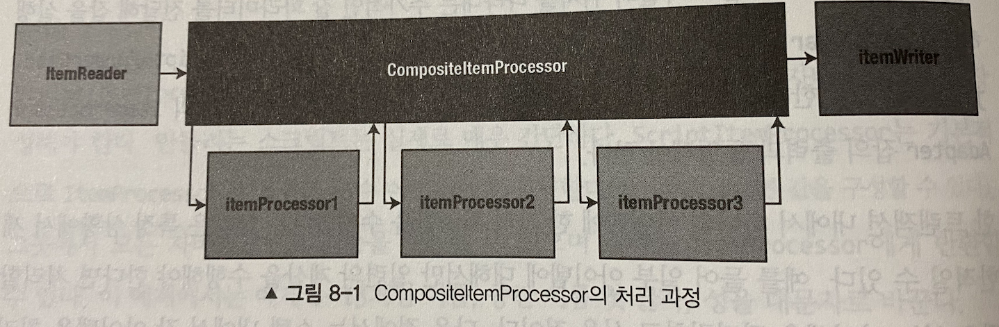

# 8장 ItemProcessor
- ItemProcessor 는 스프링 배치내에서 입력 데이터를 이용해 어떤 작업을 수행하는 컴포넌트이다.
- ItemProcessor 의 일반적인 용도 중 하나는, ItemReader 가 읽은 아이템을 ItemWriter 가 쓰기 처리를 하지 않도록 필터링 하는 것이다.

## ItemProcessor
- 대부분의 시나리오 에서는 읽은 데이터를 사용해 **특정 작업을 수행** 해야 한다.
- 스프링 배치는 읽기, 처리, 쓰기 간에 고려해야 하는 문제를 잘 구분할 수 있도록 스텝을 여러 부분으로 분리 하였다.
- 이렇게 분리함으로 인해 몇 가지 고유한 작업 수행이 가능해진다.
  1. 입력의 유효성 검증
     - 이전 버전의 스프링배치에서는 **ValidatingItemReader**  를 서브클래싱 하는 방식을 사용했다.
       - ValidatingItemReader 또한 DelegatingItemReader 로 대체되었으나 제거됨
       - https://github.com/spring-projects/spring-batch/issues/3168
     - 이 방법의 가장 큰 문제는 스프링 배치가 제공하는 ItemReader 들 중 어떤 것도 ValidatingItemReader 를 서브클래싱 하고 있지 않기 때문에, 유효성 검사가 필요할 때 바로 사용가능한 ItemReader 가 없었다.
     - ItemProcessor 가 유효성 검증을 수행하면, 입력 방법에 종속되지 않고 Write 수행 전 유효성 검증을 수행할 수 있으며 **역할 과 책임** 의 관점에서 훨씬 더 의미가 있다.
  2. 기존 서비스의 재사용
     - 입력데이터를 다룰때 기존 서비스를 재사용하는 방법과 관련된 **ItemReaderAdapter** 처럼 같은 관점에서 **ItemProcessorAdapter** 를 제공한다.
  3. 스크립트 실행
     - ItemProcessor 를 사용하면 다른 개발자나 팀의 로직과 연결할 좋은 기회일 수 있지만, 다른 팀이 스프링을 사용하지 않을 수 있다.
     - **ScriptItemProcessor** 를 이용하면 특정 스크립트를 실행할 수 있는데, 스크립트에 입력으로 아이템을 제공하고 스크립트의 출력을 반환값으로 사용할 수 있다.
  4. ItemProcessor 체이닝
     - 동일한 트랜잭션 내에서 단일 아이템으로 여러 작업를 수행해야할 상황이 존재할 수 있다.
     - 단일 클래스내에서 모든 로직이 수행되도록 ItemProcessor 를 구성할 수도 있지만 이는 **단일책임의 원칙 관점** 에서 봤을때 좋은 구조가 아니다.
       - 또한 재사용성도 떨어진다.
     - 각 Processor 별로 ItemProcessor 들을 구성하고, 이를 하나로 묶어 **각 아이템에 대해 순서대로 실행될 ItemProcessor 목록** 을 만들 수 있다.

`ItemProcessor`

```java
public interface ItemProcessor<I, O> {

	/**
	 * Process the provided item, returning a potentially modified or new item for continued
	 * processing.  If the returned result is {@code null}, it is assumed that processing of the item
	 * should not continue.
	 * 
	 * A {@code null} item will never reach this method because the only possible sources are:
	 * <ul>
	 *     <li>an {@link ItemReader} (which indicates no more items)</li>
	 *     <li>a previous {@link ItemProcessor} in a composite processor (which indicates a filtered item)</li>
	 * </ul>
	 * 
	 * @param item to be processed, never {@code null}.
	 * @return potentially modified or new item for continued processing, {@code null} if processing of the
	 *  provided item should not continue.
	 * @throws Exception thrown if exception occurs during processing.
	 */
	@Nullable
	O process(@NonNull I item) throws Exception;
}
```
- ItemProcessor 는 입력값과 반환값이 반드시 동일하지 않아도 된다.
- 최종적으로 **ItemProcessor 가 반환하는 값은 ItemWriter 의 입력값** 이 된다.
- ItemProcessor 가 **null 을 반환하면 해당 아이템 이후 모든 처리가 중지** 된다.
  - 추가적으로 수행해야할 ItemProcessor/ItemWriter 는 호출되지 않는다.
  - ItemReader 의 경우 null 을 반환하면 **해당 스탭이 완료된 것으로 간주** 한다.
  - 이와 달리 ItemProcessor 는 **해당 아이템의 처리만 중지** 되고, 다른 아이템의 처리는 계속 이루어진다.

## ValidatingItemProcessor
- 스프링 배치의 이전버전에서는 유효성 검사를 위해 ValidatingItemReader 또는 DelegatingItemReader 사용했지만, ValidatingItemProcessor 를 사용하도록 대체되었다.
- ItemReader 에서 유효성 검증을 수행할 수도 있지만, 아이템이 구성된 이후 수행하는 비즈니스 규칙에 대한 유효성 검증은 리더가 아닌 다른곳에서 수행하는것이 좋다.
- 스프링 배치는 **ValidatingItemProcessor** 라는 입력 데이터 유효성 검증에 사용가능한 ItemProcessor 구현체를 제공한다.

`ValidatingItemProcessor`

```java
public class ValidatingItemProcessor<T> implements ItemProcessor<T, T>, InitializingBean {

	private Validator<? super T> validator;

	private boolean filter = false;

	/**
	 * Default constructor
	 */
	public ValidatingItemProcessor() {
	}

	/**
	 * Creates a ValidatingItemProcessor based on the given Validator.
	 *
	 * @param validator the {@link Validator} instance to be used.
	 */
	public ValidatingItemProcessor(Validator<? super T> validator) {
		this.validator = validator;
	}

	/**
	 * Set the validator used to validate each item.
	 * 
	 * @param validator the {@link Validator} instance to be used.
	 */
	public void setValidator(Validator<? super T> validator) {
		this.validator = validator;
	}

	/**
	 * Should the processor filter invalid records instead of skipping them?
	 * 
	 * @param filter if set to {@code true}, items that fail validation are filtered
	 * ({@code null} is returned).  Otherwise, a {@link ValidationException} will be
	 * thrown.
	 */
	public void setFilter(boolean filter) {
		this.filter = filter;
	}

	/**
	 * Validate the item and return it unmodified
	 * 
	 * @return the input item
	 * @throws ValidationException if validation fails
	 */
    @Nullable
	@Override
	public T process(T item) throws ValidationException {
		try {
			validator.validate(item);
		}
		catch (ValidationException e) {
			if (filter) {
				return null; // filter the item
			}
			else {
				throw e; // skip the item
			}
		}
		return item;
	}

    @Override
	public void afterPropertiesSet() throws Exception {
		Assert.notNull(validator, "Validator must not be null.");
	}

}
```
- ValidatingItemProcessor 는 입력 아이템의 유효성 검증을 수행하는 **스프링 배치의 Validator 인터페이스** 구현체를 사용할 수 있다.
- 유효성 검증에 실패하면 org.springframework.batch.item.validator.ValidationException 예외가 발생한다.

`Validator`

```java
public interface Validator<T> {
	/**
	 * Method used to validate if the value is valid.
	 * 
	 * @param value object to be validated
	 * @throws ValidationException if value is not valid.
	 */
	void validate(T value) throws ValidationException;
}
```

### 입력 유효성 검증

`의존성 추가`
- JSR-303 구현체를 사용하기 위한 의존성 추가

```xml
<dependency>
    <groupId>org.springframework.boot</groupId>
    <artifactId>spring-boot-starter-validation</artifactId>
</dependency>
```

`도메인 클래스`

```java
@Data
@NoArgsConstructor
public class Customer {

    @NotNull(message = "First name is required")
    @Pattern(regexp = "[a-zA-z]", message = "First name must be alphabetical")
    private String firstName;

    @Size(min = 1, max = 1)
    @Pattern(regexp = "[a-zA-z]", message = "Middle initial must be alphabetical")
    private String middleInitial;

    @NotNull(message = "Last name is required")
    @Pattern(regexp = "[a-zA-z]", message = "Last name must be alphabetical")
    private String lastName;

    @NotNull(message = "Address is required")
    @Pattern(regexp = "[a-zA-z\\. ]+")
    private String address;

    @NotNull(message = "City is required")
    @Pattern(regexp = "[a-zA-z\\. ]+")
    private String city;

    @NotNull(message = "State is required")
    @Size(min = 2, max = 2)
    @Pattern(regexp = "[A-Z]{2}")
    private String state;

    /**
     * Size 와 Pattern 모두 적용한 이유 ? -> Pattern 만적용해도 요구사항은 만족할테지만, 각 애너테이션을 통해 고유 메세지 지정이 가능하다. -> 또한
     * 필드 값의 길이가 잘못되었는지, 형식이 잘못되었는지 식별이 가능하다는 장점이 있다.
     */
    @NotNull(message = "Zip is required")
    @Size(min = 5, max = 5)
    @Pattern(regexp = "\\d{5}")
    private String zip;
}
```

`BeanValidatingItemProcessor`

```java
public class BeanValidatingItemProcessor<T> extends ValidatingItemProcessor<T> {
    private Validator validator;

    public BeanValidatingItemProcessor() {
        LocalValidatorFactoryBean localValidatorFactoryBean = new LocalValidatorFactoryBean();
        localValidatorFactoryBean.afterPropertiesSet();
        this.validator = localValidatorFactoryBean.getValidator();
    }

    public BeanValidatingItemProcessor(LocalValidatorFactoryBean localValidatorFactoryBean) {
        Assert.notNull(localValidatorFactoryBean, "localValidatorFactoryBean must not be null");
        this.validator = localValidatorFactoryBean.getValidator();
    }

    public void afterPropertiesSet() throws Exception {
        SpringValidatorAdapter springValidatorAdapter = new SpringValidatorAdapter(this.validator);
        SpringValidator<T> springValidator = new SpringValidator();
        springValidator.setValidator(springValidatorAdapter);
        springValidator.afterPropertiesSet();
        this.setValidator(springValidator);
        super.afterPropertiesSet();
    }
}
```
- JSR-303 애노테이션을 사용한 아이템은, **BeanValidatingItemProcessor** 을 사용해 검증을 수행할 수 있다.
- 이는 ValidatingItemProcessor 를 상속한 ItemProcessor 이다.

> 스프링 배치가 제공하는 Validator 인터페이스는 스프링 이 제공하는 Validator 인터페이스와 다르다. <br/>
> 스프링 배치는 이를 위한 **SpringValidator** 라는 어댑터 클래스를 제공한다.

`SpringValidaor`

```java
/**
 Adapts the org.springframework.validation.Validator interface to Validator.
 Author: Tomas Slanina, Robert Kasanicky
 */
public class SpringValidator<T> implements Validator<T>, InitializingBean {

	private org.springframework.validation.Validator validator;

	/**
	 * @see Validator#validate(Object)
	 */
    @Override
	public void validate(T item) throws ValidationException {

		if (!validator.supports(item.getClass())) {
			throw new ValidationException("Validation failed for " + item + ": " + item.getClass().getName()
					+ " class is not supported by validator.");
		}

		BeanPropertyBindingResult errors = new BeanPropertyBindingResult(item, "item");

		validator.validate(item, errors);

		if (errors.hasErrors()) {
			throw new ValidationException("Validation failed for " + item + ": " + errorsToString(errors), new BindException(errors));
		}
	}

	/**
	 * @return string of field errors followed by global errors.
	 */
	private String errorsToString(Errors errors) {
		StringBuilder builder = new StringBuilder();

		appendCollection(errors.getFieldErrors(), builder);
		appendCollection(errors.getGlobalErrors(), builder);

		return builder.toString();
	}

	/**
	 * Append the string representation of elements of the collection (separated
	 * by new lines) to the given StringBuilder.
	 */
	private void appendCollection(Collection<?> collection, StringBuilder builder) {
		for (Object value : collection) {
			builder.append("\n");
			builder.append(value.toString());
		}
	}

	public void setValidator(org.springframework.validation.Validator validator) {
		this.validator = validator;
	}

    @Override
	public void afterPropertiesSet() throws Exception {
		Assert.notNull(validator, "validator must be set");

	}
}
```

`customer.csv`

```java
Richard,N,Darrow,5570 Isabella Ave,St. Louis,IL,58540
Barack,G,Donnelly,7844 S. Greenwood Ave,Houston,CA,38635
Ann,Z,Benes,2447 S. Greenwood Ave,Las Vegas,NY,55366
Laura,9S,Minella,8177 4th Street,Dallas,FL,04119
Erica,Z,Gates,3141 Farnam Street,Omaha,CA,57640
Warren,L,Darrow,4686 Mt. Lee Drive,St. Louis,NY,94935
Warren,M,Williams,6670 S. Greenwood Ave,Hollywood,FL,37288
Harry,T,Smith,3273 Isabella Ave,Houston,FL,97261
Steve,O,James,8407 Infinite Loop Drive,Las Vegas,WA,90520
Erica,Z,Neuberger,513 S. Greenwood Ave,Miami,IL,12778
Aimee,C,Hoover,7341 Vel Avenue,Mobile,AL,35928
Jonas,U,Gilbert,8852 In St.,Saint Paul,MN,57321
Regan,M,Darrow,4851 Nec Av.,Gulfport,MS,33193
Stuart,K,Mckenzie,5529 Orci Av.,Nampa,ID,18562
Sydnee,N,Robinson,894 Ornare. Ave,Olathe,KS,25606
```

`배치 잡 설정`

```java
@EnableBatchProcessing
@SpringBootApplication
public class ValidationJob {

    @Autowired
    private JobBuilderFactory jobBuilderFactory;

    @Autowired
    private StepBuilderFactory stepBuilderFactory;

    @StepScope
    @Bean
    public FlatFileItemReader<Customer> customerItemReader(
        @Value("#{jobParameters['customerFile']}") Resource resource
    ) {
        return new FlatFileItemReaderBuilder<Customer>()
            .name("customerItemReader")
            .delimited()
            .names(
                "firstName", "middleInitial", "lastName",
                "address", "city", "state", "zip"
            )
            .targetType(Customer.class)
            .resource(resource)
            .build();
    }

    @Bean
    public ItemWriter<Customer> itemWriter() {
        return (items) -> items.forEach(System.out::println);
    }

    @Bean
    public BeanValidatingItemProcessor<Customer> customerValidatingItemProcessor() {
        return new BeanValidatingItemProcessor<>();
    }

    @Bean
    public Step copyFileStep() {
        return this.stepBuilderFactory.get("copyFileStep")
            .<Customer, Customer>chunk(5)
            .reader(customerItemReader(null))
            .processor(customerValidatingItemProcessor())
            .writer(itemWriter())
            .build();
    }

    @Bean
    public Job job() {
        return this.jobBuilderFactory.get("customerValidationJob")
            .start(copyFileStep())
            .build();
    }

    public static void main(String[] args) {
        SpringApplication.run(ValidationJob.class, "customerFile=classpath:input/customer.csv",
            "id=2");
    }
}
```

`CustomValidator 를 사용한 입력 검증하기`

```java
/**
 * ItemStreamSupport 클래스를 통해 ItemStream 인터페이스를 구현 lastNames 상태를 ExecutionContext 를 통해 관리한다.
 */
public class UniqueLastNameValidator extends ItemStreamSupport implements Validator<Customer> {

    private Set<String> lastNames = new HashSet<>();

    @Override
    public void validate(Customer value) throws ValidationException {
        if (lastNames.contains(value.getLastName())) {
            throw new ValidationException("Duplicate last name was found : " + value.getLastName());
        }
        lastNames.add(value.getLastName());
    }

    /**
     * ExecutionContext 를 통해 기존의 LastNames 를 가져온다.
     */
    @Override
    public void open(ExecutionContext executionContext) {
        String lastNames = getExecutionContextKey("lastNames");
        if (executionContext.containsKey(lastNames)) {
            this.lastNames = (Set<String>) executionContext.get(lastNames);
        }
    }

    /**
     * ExecutionContext 를 통해 LastNames 를 저장한다.
     */
    @Override
    public void update(ExecutionContext executionContext) {
        Iterator<String> iter = lastNames.iterator();
        Set<String> copiedLastNames = new HashSet<>();
        while (iter.hasNext()) {
            copiedLastNames.add(iter.next());
        }
        executionContext.put(getExecutionContextKey("lastNames"), copiedLastNames);
    }
}
```
- UniqueLastNameValidator 클래스는 중복되는 LastName 이 존재하는지 검증한다.
- ItemReader 가 아이템을 읽어 전달할 때 마다 lastNames 라는 컬렉션에 이를 저장하고, 만약 기존에 존재하는 lastName 이라면 벨리데이션 에러를 발생시킨다.
- JobExecution 간에 상태를 공유하기 위해서 ExecutionContext 를 사용한다.
  - LastNames 컬렉션을 관리하기 위해 ItemStreamSupport 클래스를 상속받아 구현한다.

```java
@EnableBatchProcessing
@SpringBootApplication
public class ValidationJob {

    @Autowired
    private JobBuilderFactory jobBuilderFactory;

    @Autowired
    private StepBuilderFactory stepBuilderFactory;

    @StepScope
    @Bean
    public FlatFileItemReader<Customer> customerItemReader(
        @Value("#{jobParameters['customerFile']}") Resource resource
    ) {
        return new FlatFileItemReaderBuilder<Customer>()
            .name("customerItemReader")
            .delimited()
            .names(
                "firstName", "middleInitial", "lastName",
                "address", "city", "state", "zip"
            )
            .targetType(Customer.class)
            .resource(resource)
            .build();
    }

    @Bean
    public ItemWriter<Customer> itemWriter() {
        return (items) -> items.forEach(System.out::println);
    }

    @Bean
    public UniqueLastNameValidator validator() {
        UniqueLastNameValidator validator = new UniqueLastNameValidator();
        validator.setName("validator");
        return validator;
    }

    /**
     * 커스텀 벨리데이터를 사용하는 아이템 프로세서
     */
    @Bean
    public ValidatingItemProcessor<Customer> customValidatingItemProcessor() {
        return new ValidatingItemProcessor<>(validator());
    }

    @Bean
    public Step copyFileStep() {
        return this.stepBuilderFactory.get("copyFileStep")
            .<Customer, Customer>chunk(5)
            .reader(customerItemReader(null))
            .processor(customValidatingItemProcessor())
            .writer(itemWriter())
            .build();
    }

    @Bean
    public Job job() {
        return this.jobBuilderFactory.get("customerValidationJob")
            .start(copyFileStep())
            .build();
    }

    public static void main(String[] args) {
        SpringApplication.run(ValidationJob.class, "customerFile=classpath:input/customer.csv",
            "id=2");
    }
}
```

## ItemProcessorAdapter
- 아이템 리더를 사용할때 기존 서비스를 재사용하기 위해 ItemReaderAdapter 를 사용했었다.
- 이와 마찬가지로 기존 서비스를 재사용하기 위한 **ItemProcessorAdapter** 를 제공한다.

`UpperCaseNameService`

```
/**
 * 고객의 이름을 대문자로 변경하는 서비스
 */
public class UpperCaseNameService {

    public Customer upperCase(Customer customer) {
        Customer newCustomer = new Customer(customer);
        newCustomer.setFirstName(newCustomer.getFirstName().toUpperCase());
        newCustomer.setMiddleInitial(newCustomer.getMiddleInitial().toUpperCase());
        newCustomer.setLastName(newCustomer.getLastName().toUpperCase());
        return newCustomer;
    }
}
```
- Customer 객체를 받아 이름에 해당하는 필드들을 대문자로 변경해주는 단순한 서비스이다.

`배치 잡 구성`

```java
@EnableBatchProcessing
@SpringBootApplication
public class ItemProcessorAdapterJob {

    @Autowired
    private JobBuilderFactory jobBuilderFactory;

    @Autowired
    private StepBuilderFactory stepBuilderFactory;

    @StepScope
    @Bean
    public FlatFileItemReader<Customer> customerItemReader(
        @Value("#{jobParameters['customerFile']}") Resource resource
    ) {
        return new FlatFileItemReaderBuilder<Customer>()
            .name("customerItemReader")
            .delimited()
            .names(
                "firstName", "middleInitial", "lastName",
                "address", "city", "state", "zip"
            )
            .targetType(Customer.class)
            .resource(resource)
            .build();
    }

    @Bean
    public ItemWriter<Customer> itemWriter() {
        return (items) -> items.forEach(System.out::println);
    }

    @Bean
    public ItemProcessorAdapter<Customer, Customer> itemProcessor(UpperCaseNameService service) {
        ItemProcessorAdapter<Customer, Customer> adapter = new ItemProcessorAdapter<>();
        adapter.setTargetObject(service);
        adapter.setTargetMethod("upperCase");
        return adapter;
    }

    @Bean
    public Step copyFileStep() {
        return this.stepBuilderFactory.get("copyFileStep")
            .<Customer, Customer>chunk(5)
            .reader(customerItemReader(null))
            .processor(itemProcessor(null))
            .writer(itemWriter())
            .build();
    }

    @Bean
    public Job job() {
        return this.jobBuilderFactory.get("itemProcessorJob")
            .start(copyFileStep())
            .build();
    }

    @Bean
    public UpperCaseNameService upperCaseNameService() {
        return new UpperCaseNameService();
    }

    public static void main(String[] args) {
        SpringApplication.run(ItemProcessorAdapterJob.class,
            "customerFile=classpath:input/customer.csv");
    }
}
```

## ScriptItemProcessor
- 스크립트는 일반적으로 작성과 수정이 용이해 자주 변경되는 컴포넌트라면 스크립트가 큰 유연성을 제공할 수 있따.
- **프로토타이핑 (prototyping)** 은 자바와 같이 정적 타입 지정언어가 필요로 하는 모든 형식을 수행하는 대신 스크립트를 사용하는 또 다른 영역이다.

`uppserCase.js`

```javascript
item.setFirstName(item.getFirstName().toUpperCase());
item.setMiddleInitial(item.getMiddleInitial().toUpperCase());
item.setLastName(item.getLastName().toUpperCase());
item;
```
- 자바를 사용하는 대신 자바스크립트를 이용해 고객의 이름을 대문자로 만드는 스크립트이다.

`배치 잡 설정`

```java

@EnableBatchProcessing
@SpringBootApplication
public class ScriptItemProcessorJob {

    @Autowired
    private JobBuilderFactory jobBuilderFactory;

    @Autowired
    private StepBuilderFactory stepBuilderFactory;

    @StepScope
    @Bean
    public FlatFileItemReader<Customer> customerItemReader(
        @Value("#{jobParameters['customerFile']}") Resource resource
    ) {
        return new FlatFileItemReaderBuilder<Customer>()
            .name("customerItemReader")
            .delimited()
            .names(
                "firstName", "middleInitial", "lastName",
                "address", "city", "state", "zip"
            )
            .targetType(Customer.class)
            .resource(resource)
            .build();
    }

    @Bean
    public ItemWriter<Customer> itemWriter() {
        return (items) -> items.forEach(System.out::println);
    }

    @StepScope
    @Bean
    public ScriptItemProcessor<Customer, Customer> itemProcessor(
        @Value("#{jobParameters['script']}") Resource script
    ) {
        ScriptItemProcessor<Customer, Customer> processor = new ScriptItemProcessor<>();
        processor.setScript(script);
        return processor;
    }

    @Bean
    public Step copyFileStep() {
        return this.stepBuilderFactory.get("copyFileStep")
            .<Customer, Customer>chunk(5)
            .reader(customerItemReader(null))
            .processor(itemProcessor(null))
            .writer(itemWriter())
            .build();
    }

    @Bean
    public Job job() {
        return this.jobBuilderFactory.get("scriptJob")
            .start(copyFileStep())
            .build();
    }

    public static void main(String[] args) {
        SpringApplication.run(ScriptItemProcessorJob.class,
            "customerFile=classpath:input/customer.csv", "script=classpath:input/upperCase.js");
    }
}
```

## CompositeItemProcessor
- 지금 까지 하나의 스탭을 세 단계 (읽기, 처리, 쓰기) 로 나눠 컴포넌트 간의 **책임** 을 분리했다.
- 마찬가지로 아이템에 적용하는 비즈니스 로직을 **단일 ItemProcessor** 가 모두 처리한다면 적절하지 않을 수 있다.
- 이런 경우 여러 ItemProcessor 로 책임을 분리하고, ItemProcessor 들을 체이닝할 수 있다면 비즈니스 로직에서도 책임 분리가 가능하다.
- 스프링 배치는 ItemProcessor 처리 과정에서 복잡한 오케스트레이션을 수행할 수 있도록 **CompositeItemProcessor** 를 제공한다.
- 이는 아이템의 처리를 ItemProcessor 구현체들에게 순서대로 위임한다.

`CompositeItemProcessor 의 처리과정`



`배치 잡 설정`

```java
@EnableBatchProcessing
@SpringBootApplication
public class CompositeItemProcessorJob {

    @Autowired
    private JobBuilderFactory jobBuilderFactory;

    @Autowired
    private StepBuilderFactory stepBuilderFactory;

    @StepScope
    @Bean
    public FlatFileItemReader<Customer> customerItemReader(
        @Value("#{jobParameters['customerFile']}") Resource resource
    ) {
        return new FlatFileItemReaderBuilder<Customer>()
            .name("customerItemReader")
            .delimited()
            .names(
                "firstName", "middleInitial", "lastName",
                "address", "city", "state", "zip"
            )
            .targetType(Customer.class)
            .resource(resource)
            .build();
    }

    @Bean
    public ItemWriter<Customer> itemWriter() {
        return (items) -> items.forEach(System.out::println);
    }

    @Bean
    public UniqueLastNameValidator validator() {
        UniqueLastNameValidator validator = new UniqueLastNameValidator();
        validator.setName("validator");
        return validator;
    }

    @Bean
    public ValidatingItemProcessor<Customer> customerValidatingItemProcessor() {
        ValidatingItemProcessor<Customer> itemProcessor = new ValidatingItemProcessor<>(
            validator());
        itemProcessor.setFilter(true);
        return itemProcessor;
    }

    @Bean
    public ItemProcessorAdapter<Customer, Customer> upperCaseItemProcessor(
        UpperCaseNameService service) {
        ItemProcessorAdapter<Customer, Customer> adapter = new ItemProcessorAdapter<>();
        adapter.setTargetObject(service);
        adapter.setTargetMethod("upperCase");
        return adapter;
    }

    @StepScope
    @Bean
    public ScriptItemProcessor<Customer, Customer> scriptItemProcessor(
        @Value("#{jobParameters['script']}") Resource script
    ) {
        ScriptItemProcessor<Customer, Customer> processor = new ScriptItemProcessor<>();
        processor.setScript(script);
        return processor;
    }

    /**
     * CompositeItemProcessor 는 모든 Item 을 모든 Processor 에게 전달한다.
     */
    @Bean
    public CompositeItemProcessor<Customer, Customer> itemProcessor() {
        CompositeItemProcessor<Customer, Customer> itemProcessor = new CompositeItemProcessor<>();
        itemProcessor.setDelegates(
            List.of(
                customerValidatingItemProcessor(),
                upperCaseItemProcessor(null),
                scriptItemProcessor(null)
            )
        );
        return itemProcessor;
    }

    @Bean
    public Step copyFileStep() {
        return this.stepBuilderFactory.get("copyFileStep")
            .<Customer, Customer>chunk(5)
            .reader(customerItemReader(null))
            .processor(itemProcessor())
            .writer(itemWriter())
            .build();
    }

    @Bean
    public Job job() {
        return this.jobBuilderFactory.get("compositeProcessorJob")
            .start(copyFileStep())
            .build();
    }

    @Bean
    public UpperCaseNameService upperCaseNameService() {
        return new UpperCaseNameService();
    }

    public static void main(String[] args) {
        SpringApplication.run(CompositeItemProcessorJob.class,
            "customerFile=classpath:input/customer.csv", "script=classpath:input/lowerCase.js");
    }
}
```

`lowerCase.js`

```javascript
item.setAddress(item.getAddress().toLowerCase());
item.setCity(item.getCity().toLowerCase());
item.setState(item.getState().toLowerCase());
item;
```

## ClassifierCompositeItemProcessor
- CompositeItemProcessor 는 강력하지만 한 가지 아쉬운 부분이 있다.
- 만약 ItemProcessor 목록중 특정 조건에 따라 일부 ItemProcessor 만 사용하고 싶다면 어떻게 해야할까 ?
- 이럴 때 사용 가능한 것이 **Classifier** 이다.

`Classifier`

```java
public interface Classifier<C, T> extends Serializable {
    T classify(C var1);
}
```
- Classifier 인터페이스는 Object 를 받아 새로운 Object 로 변환해 반환하는 classify 메소드를 가지고 있다.
- 이를 활용해, Customer 객체를 전달받아 조건에 따라 적절한 ItemProcessor 를 반환하도록 구현해 본다.

`ZipCodeClassifier`

```java
public class ZipCodeClassifier implements Classifier<Customer, ItemProcessor<Customer, Customer>> {

    private ItemProcessor<Customer, Customer> oddItemProcessor;
    private ItemProcessor<Customer, Customer> evenItemProcessor;

    public ZipCodeClassifier(
        ItemProcessor<Customer, Customer> oddItemProcessor,
        ItemProcessor<Customer, Customer> evenItemProcessor) {
        this.oddItemProcessor = oddItemProcessor;
        this.evenItemProcessor = evenItemProcessor;
    }

    @Override
    public ItemProcessor<Customer, Customer> classify(Customer customer) {
        if (Integer.parseInt(customer.getZip()) % 2 == 0) {
            return evenItemProcessor;
        }
        return oddItemProcessor;
    }
}
```
- ZipCodeClassifier 는, ZipCode 가 홀수인지/짝수인지에 따라 다르게 적용할 ItemProcessor 를 가지고 있다.
  - 홀수라면 이름을 대문자로 변환하고, 짝수라면 주소를 소문자로 변환하도록 구성할 것이다.

`ClassifierCompositeItemProcessor`

```java
public class ClassifierCompositeItemProcessor<I,O> implements ItemProcessor<I, O> {

	private Classifier<? super I, ItemProcessor<?, ? extends O>> classifier = 
			new ClassifierSupport<> (null);

	/**
	 * Establishes the classifier that will determine which {@link ItemProcessor} to use.
	 * @param classifier the {@link Classifier} to set
	 */
	public void setClassifier(Classifier<? super I, ItemProcessor<?, ? extends O>> classifier) {
		this.classifier = classifier;
	}
	
	/**
	 * Delegates to injected {@link ItemProcessor} instances according to the
	 * classification by the {@link Classifier}.
	 */
	@Nullable
	@Override
	public O process(I item) throws Exception {
		return processItem(classifier.classify(item), item);
	}
	
    /* 
     * Helper method to work around wildcard capture compiler error: see https://docs.oracle.com/javase/tutorial/java/generics/capture.html
     * The method process(capture#4-of ?) in the type ItemProcessor<capture#4-of ?,capture#5-of ? extends O> is not applicable for the arguments (I)
     */
    @SuppressWarnings("unchecked")
	private <T> O processItem(ItemProcessor<T, ? extends O> processor, I input) throws Exception {
    	return processor.process((T) input);
    }	

}
```
- ClassifierCompositeItemProcessor 는, ItemProcessor 인터페이스를 구현하고 있고, Classifier 인터페이스 구현체를 사용한다.
  - Classifier 의 구현에 따라 ItemReader 가 읽은 아이템을 가지고 특정 조건에 따라 적용할 ItemProcessor 를 반환하면, ClassifierCompositeItemProcessor 는 해당 ItemProcessor 에 처리를 위임한다. 

`배치 잡 설정`

```java
@EnableBatchProcessing
@SpringBootApplication
public class ClassifierJob {

    @Autowired
    private JobBuilderFactory jobBuilderFactory;

    @Autowired
    private StepBuilderFactory stepBuilderFactory;

    @StepScope
    @Bean
    public FlatFileItemReader<Customer> customerItemReader(
        @Value("#{jobParameters['customerFile']}") Resource resource
    ) {
        return new FlatFileItemReaderBuilder<Customer>()
            .name("customerItemReader")
            .delimited()
            .names(
                "firstName", "middleInitial", "lastName",
                "address", "city", "state", "zip"
            )
            .targetType(Customer.class)
            .resource(resource)
            .build();
    }

    @Bean
    public ItemWriter<Customer> itemWriter() {
        return (items) -> items.forEach(System.out::println);
    }

    @Bean
    public UniqueLastNameValidator validator() {
        UniqueLastNameValidator validator = new UniqueLastNameValidator();
        validator.setName("validator");
        return validator;
    }

    @Bean
    public ValidatingItemProcessor<Customer> customerValidatingItemProcessor() {
        ValidatingItemProcessor<Customer> itemProcessor = new ValidatingItemProcessor<>(
            validator());
        itemProcessor.setFilter(true);
        return itemProcessor;
    }

    @Bean
    public ItemProcessorAdapter<Customer, Customer> upperCaseItemProcessor(
        UpperCaseNameService service) {
        ItemProcessorAdapter<Customer, Customer> adapter = new ItemProcessorAdapter<>();
        adapter.setTargetObject(service);
        adapter.setTargetMethod("upperCase");
        return adapter;
    }

    @StepScope
    @Bean
    public ScriptItemProcessor<Customer, Customer> scriptItemProcessor(
        @Value("#{jobParameters['script']}") Resource script
    ) {
        ScriptItemProcessor<Customer, Customer> processor = new ScriptItemProcessor<>();
        processor.setScript(script);
        return processor;
    }

    @Bean
    public Step copyFileStep() {
        return this.stepBuilderFactory.get("copyFileStep")
            .<Customer, Customer>chunk(5)
            .reader(customerItemReader(null))
            .processor(itemProcessor())
            .writer(itemWriter())
            .build();
    }

    /**
     * ZipCode 가 홀수면 UpperCase / 짝수면 lowerCase 를 적용한다.
     */
    @Bean
    public Classifier classifier() {
        return new ZipCodeClassifier(upperCaseItemProcessor(null), scriptItemProcessor(null));
    }

    @Bean
    public ClassifierCompositeItemProcessor<Customer, Customer> itemProcessor() {
        ClassifierCompositeItemProcessor<Customer, Customer> itemProcessor = new ClassifierCompositeItemProcessor<>();
        itemProcessor.setClassifier(classifier());
        return itemProcessor;
    }

    @Bean
    public Job job() {
        return this.jobBuilderFactory.get("classifierJob")
            .start(copyFileStep())
            .build();
    }

    @Bean
    public UpperCaseNameService upperCaseNameService() {
        return new UpperCaseNameService();
    }

    public static void main(String[] args) {
        SpringApplication.run(ClassifierJob.class, "customerFile=classpath:input/customer.csv",
            "script=classpath:input/lowerCase.js", "id=1");
    }
}
```

## 커스텀 ItemProcessor
- ItemProcessor 는 스프링 프레임워크에서 직접 구현하게 가장 쉬우며, 의도적으로 설계되었다.
- ItemProcessor 는 이를 처리할 비즈니스 로직이 담기는 곳이기 때문에 항상 직접 구현해야 한다.

### 아이템 필터링
- 짝수 우편번호를 필터링 하는 ItemProcessor

```java
/**
 * 스프링배치는 ItemProcessor 가 null 을 반환하면 해당 아이템을 필터링 함으로써 과정을 단순화한다. 짝수일 경우 필터링 하는 ItemProcessor
 */
public class EventFilteringItemProcessor implements ItemProcessor<Customer, Customer> {

    @Override
    public Customer process(Customer item) throws Exception {
        return Integer.parseInt(item.getZip()) % 2 == 0 ? null : item;
    }
}
```
- 스프링 배치는 ItemProcessor 가 null 을 반환하면 해당 아이템을 필터링 함으로써 과정을 단순화 한다.
- 필터된 레코드 수를 보관하고 이를 JobRepository 에 저장한다.

## 정리
- 7장에서는 처리하지 않은 레코드를 식별하는 방법으로 예외를 사용한 아이템 건너뛰기 방식 (Skip) 을 살펴보았다.
- ItemProcessor 를 통해 필터하는 방식와 건너뛰기 방식의 차이는 건너뛰기 방식에서는 기술적으로 **유효한 레코드를 대상** 으로 한다는 점이다.