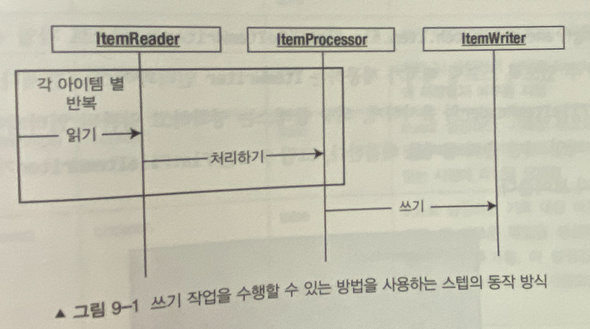
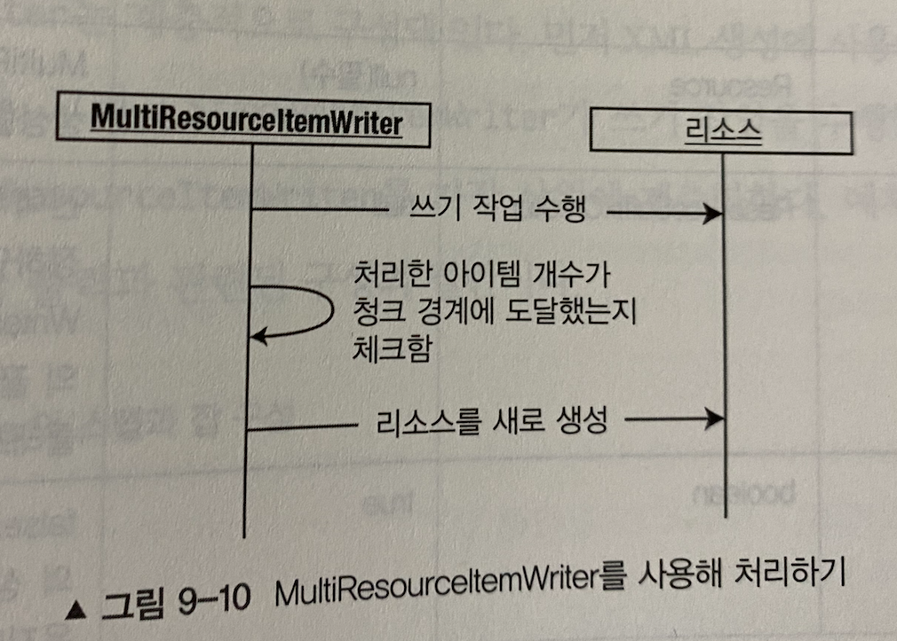
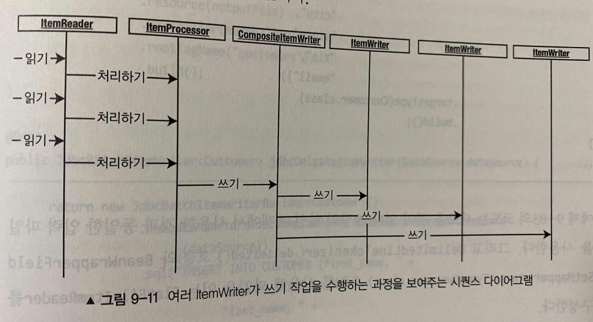

# 9장 ItemWriter

## ItemWriter
- ItemWriter 는 스프링 배치의 **출력 메커니즘**
- 스프링 배치 초창기에는 ItemReader 와 동일하게 각 아이템이 처리되는 순서대로 출력을 진행했다.
- 스프링 배치2 부터 청크 기반 처리 방식이 도입된 이후 ItemWriter 의 역할이 변경되었다.
- 청크 기반 처리시 ItemWriter 는 아이템을 묶음 단위로 쓴다.
  - 때문에 ItemReader 인터페이스와는 조금 다르다.

```java
public interface ItemWriter<T> {

	/**
	 * Process the supplied data element. Will not be called with any null items
	 * in normal operation.
	 *
	 * @param items items to be written
	 * @throws Exception if there are errors. The framework will catch the
	 * exception and convert or rethrow it as appropriate.
	 */
	void write(List<? extends T> items) throws Exception;

}
```

`ItemWriter Process`



- 청크 기반 처리 방식이 도입된 이후 ItemWriter 호출횟수가 줄었지만 약간 다른 처리방법이 필요하다.
- 파일과 같이 트랜잭션이 적용되지 않는 리소스 처리시 이미 쓰인 내용을 롤백할 방법이 없다.
- 때문 이를 위한 추가적인 보호조치가 필요하다.

## 파일기반 ItemWriter
- org.springframework.batch.item.file.FlatFileItemWriter 는 텍스트 파일 출력을 위해 제공하는 궇녀체이다.

```java
public class FlatFileItemWriter<T> extends AbstractFileItemWriter<T> {

	protected LineAggregator<T> lineAggregator;

	public FlatFileItemWriter() {
		this.setExecutionContextName(ClassUtils.getShortName(FlatFileItemWriter.class));
	}

	/**
	 * Assert that mandatory properties (lineAggregator) are set.
	 * 
	 * @see org.springframework.beans.factory.InitializingBean#afterPropertiesSet()
	 */
	@Override
	public void afterPropertiesSet() throws Exception {
		Assert.notNull(lineAggregator, "A LineAggregator must be provided.");
		if (append) {
			shouldDeleteIfExists = false;
		}
	}

	/**
	 * Public setter for the {@link LineAggregator}. This will be used to
	 * translate the item into a line for output.
	 * 
	 * @param lineAggregator the {@link LineAggregator} to set
	 */
	public void setLineAggregator(LineAggregator<T> lineAggregator) {
		this.lineAggregator = lineAggregator;
	}

	@Override
	public String doWrite(List<? extends T> items) {
		StringBuilder lines = new StringBuilder();
		for (T item : items) {
			lines.append(this.lineAggregator.aggregate(item)).append(this.lineSeparator);
		}
		return lines.toString();
	}

}
```
- FlatFileItemReader 와 유사한 구성을 하고 있다.
  - Resource
  - LineAggregator : LineMapper 와 유사

`FlatFileItemWriter 의 구성 옵션`

| Option | Type | Default | Description |
| --- | --- | --- | --- |
| encoding | String | UTF-8 | 파일 문자 인코딩 |
| footerCallback | FlatFileFooterCallback | null | 마지막 아이템 처리후 콜백됨 |
| headerCallback | FlatFileHeaderCallback | null | 첫번째 아이템 처리 전 콜백됨 |
| lineAggregator | LineAggregator | null (필수) | 개별 아이템을 출력용 문자열로 변환시 사용됨 |
| lineSeparator | String | 시스템 개행문자 | 생성된 파일의 개행 문자 |
| resource | Resource | null (필수) | 쓰기 작업 대상 파일 또는 스트림 |
| saveState | boolean | true | 처리지 Writer 상태를 ExecutionContext 에 저장할지 여부 결정 |
| shouldDeleteIfEmpty | boolean | false | true 지정시 레코드가 없을때 리더를 닫는 시점에 파일을 삭제 |
| appendAllowed | boolean | false | true 지정시 파일이 존재한다면 기존 파일에 추가한다. (위 옵션을 false 로 자동 변경함) |
| shouldDeleteIfExists | boolean | true | true 지정시 파일이 존재한다면 파일을 삭제하고 새롭게 생성함 |
| transactional | boolean | true | true 지정시 트랜잭션 활성화 상태에서 트랜잭션 커밋 전까지 파일에 쓰기 작업을 지연한다. |

`FieldExtractor`
- 아이템의 필드에 접근할 수 있게 제공되는 인터페이스
- 스프링 배치는 기본적으로 두개의 구현체를 제공한다.

```java
public interface FieldExtractor<T> {

	/**
	 * @param item the object that contains the information to be extracted.
	 * @return an array containing item's parts
	 */
	Object[] extract(T item);

}
```

```java
public class BeanWrapperFieldExtractor<T> implements FieldExtractor<T>, InitializingBean {

	private String[] names;

	/**
	 * @param names field names to be extracted by the {@link #extract(Object)} method.
	 */
	public void setNames(String[] names) {
		Assert.notNull(names, "Names must be non-null");
		this.names = Arrays.asList(names).toArray(new String[names.length]);
	}

	/**
	 * @see org.springframework.batch.item.file.transform.FieldExtractor#extract(java.lang.Object)
	 */
    @Override
	public Object[] extract(T item) {
		List<Object> values = new ArrayList<>();

		BeanWrapper bw = new BeanWrapperImpl(item);
		for (String propertyName : this.names) {
			values.add(bw.getPropertyValue(propertyName));
		}
		return values.toArray();
	}

    @Override
	public void afterPropertiesSet() {
		Assert.notNull(names, "The 'names' property must be set.");
	}
}
```
- 전통적인 Java Beans 스펙을 준수하는 접근 법을 사용한다.

```java
public class PassThroughFieldExtractor<T> implements FieldExtractor<T> {

	/**
	 * Get an array of fields as close as possible to the input. The result
	 * depends on the type of the input:
	 * <ul>
	 * <li>A {@link FieldSet} or array will be returned as is</li>
	 * <li>For a Collection the <code>toArray()</code> method will be used</li>
	 * <li>For a Map the <code>values()</code> will be returned as an array</li>
	 * <li>Otherwise it is wrapped in a single element array.</li>
	 * </ul>
	 * Note that no attempt is made to sort the values, so passing in an
	 * unordered collection or map is probably a bad idea. Spring often gives
	 * you an ordered Map (e.g. if extracting data from a generic query using
	 * JDBC), so check the documentation for whatever is being used to generate
	 * the input.
	 * 
	 * @param item the object to convert
	 * @return an array of objects as close as possible to the original item
	 */
    @Override
	public Object[] extract(T item) {

		if (item.getClass().isArray()) {
			return (Object[]) item;
		}

		if (item instanceof Collection<?>) {
			return ((Collection<?>) item).toArray();
		}

		if (item instanceof Map<?, ?>) {
			return ((Map<?, ?>) item).values().toArray();
		}

		if (item instanceof FieldSet) {
			return ((FieldSet) item).getValues();
		}

		return new Object[] { item };

	}

}
```
- 아이템을 바로 반한한다, 아이템이 문자열인 경우 등에서 유용

> FlatFileItemWriter 는 데이터 노출을 제헌해 롤백이 가능한 커밋 전 마지막 순간까지 출력 데이터의 저장을 **지연** 시킨다.

- 데이터 기록시 **TransactionSynchronizationAdapter#beforeCommit** 메소드를 이용해 이 메커니즘을 구현했다.

### 형식화된 텍스트 파일

`customer.csv`

```text
Richard,N,Darrow,5570 Isabella Ave,St. Louis,IL,58540
Barack,G,Donnelly,7844 S. Greenwood Ave,Houston,CA,38635
Ann,Z,Benes,2447 S. Greenwood Ave,Las Vegas,NY,55366
Laura,S,Minella,8177 4th Street,Dallas,FL,04119
Erica,Z,Gates,3141 Farnam Street,Omaha,CA,57640
Warren,L,Darrow,4686 Mt. Lee Drive,St. Louis,NY,94935
Warren,M,Williams,6670 S. Greenwood Ave,Hollywood,FL,37288
Harry,T,Smith,3273 Isabella Ave,Houston,FL,97261
Steve,O,James,8407 Infinite Loop Drive,Las Vegas,WA,90520
Erica,Z,Neuberger,513 S. Greenwood Ave,Miami,IL,12778
Aimee,C,Hoover,7341 Vel Avenue,Mobile,AL,35928
Jonas,U,Gilbert,8852 In St.,Saint Paul,MN,57321
Regan,M,Darrow,4851 Nec Av.,Gulfport,MS,33193
Stuart,K,Mckenzie,5529 Orci Av.,Nampa,ID,18562
Sydnee,N,Robinson,894 Ornare. Ave,Olathe,KS,25606
```

`Customer.java`

```java
@Data
public class Customer implements Serializable {

    private static final long serialVersionUID = 1L;
    
    private long id;
    private String firstName;
    private String middleInitial;
    private String lastName;
    private String address;
    private String city;
    private String state;
    private String zip;
}
```

`배치 잡 설정`

```java
@EnableBatchProcessing
@SpringBootApplication
public class FormattedTextFileBatchConfiugration {

  @Autowired
  private JobBuilderFactory jobBuilderFactory;

  @Autowired
  private StepBuilderFactory stepBuilderFactory;

  @StepScope
  @Bean
  public FlatFileItemReader<Customer> customerFileItemReader(
          @Value("#{jobParameters['customerFile']}") Resource inputFile
  ) {
    return new FlatFileItemReaderBuilder<Customer>()
            .name("customerFileReader")
            .resource(inputFile)
            .delimited()
            .names("firstName", "middleInitial", "lastName", "address", "city", "state", "zip")
            .targetType(Customer.class)
            .build();
  }

  @StepScope
  @Bean
  public FlatFileItemWriter<Customer> customerItemWriter(
          @Value("#{jobParameters['outputFile']}") Resource outputFile
  ) {
    return new FlatFileItemWriterBuilder<Customer>()
            .name("customerItemWriter")
            .resource(outputFile)
            .formatted()
            .format("%s %s lived at %s %s in %s, %s.")
            .names("firstName", "middleInitial", "lastName", "address", "city", "state", "zip")
            .shouldDeleteIfEmpty(true) // 스탭 완료시 사용된다. 기본값 false / 스탭 종료후 아무런 것도 파일에 작성되지 않았다면 (헤더,푸터 제외) 스탭완료시 해당 파일 삭제
            .shouldDeleteIfExists(false) // 스탭의 쓰기작업 대상 파일이 존재한다면 해당 파일을 삭제한다. 기본값 true / false 로 지정된 경우에 파일이 존재한다면 ItemStreamException 이 발생
            .append(true) // 기본값 false , true 로 지정한다면  shouldDeleteIfExists 값을 false 로 자동지정하고 결과 파일이 없다면 새파일을 생성, 결과 파일에 있다면 기존 파일에 데이터를 추가한다.
            .build();
  }

  @Bean
  public Step formatStep() {
    return this.stepBuilderFactory.get("formatStep")
            .<Customer, Customer>chunk(10)
            .reader(customerFileItemReader(null))
            .writer(customerItemWriter(null))
            .build();
  }

  @Bean
  public Job formatJob() {
    return this.jobBuilderFactory.get("formatJob")
            .start(formatStep())
            .incrementer(new RunIdIncrementer())
            .build();
  }

  public static void main(String[] args) {
    SpringApplication.run(FormattedTextFileBatchConfiugration.class,
            "customerFile=classpath:input/customer.csv",
            "outputFile=file:formattedCustomers.txt");
  }
}
```

### 구분자로 구분된 파일

```java
@EnableBatchProcessing
@SpringBootApplication
public class DelimitedTextFileBatchConfiugration {

    @Autowired
    private JobBuilderFactory jobBuilderFactory;

    @Autowired
    private StepBuilderFactory stepBuilderFactory;

    @StepScope
    @Bean
    public FlatFileItemReader<Customer> customerFileItemReader(
        @Value("#{jobParameters['customerFile']}") Resource inputFile
    ) {
        return new FlatFileItemReaderBuilder<Customer>()
            .name("customerFileReader")
            .resource(inputFile)
            .delimited()
            .names("firstName", "middleInitial", "lastName", "address", "city", "state", "zip")
            .targetType(Customer.class)
            .build();
    }

    @StepScope
    @Bean
    public FlatFileItemWriter<Customer> customerItemWriter(
        @Value("#{jobParameters['outputFile']}") Resource outputFile
    ) {
        return new FlatFileItemWriterBuilder<Customer>()
            .name("customerItemWriter")
            .resource(outputFile)
            .delimited()
            .delimiter(";")
            .names("firstName", "middleInitial", "lastName", "address", "city", "state", "zip")
            .build();
    }

    @Bean
    public Step step() {
        return this.stepBuilderFactory.get("delimitedStep")
            .<Customer, Customer>chunk(10)
            .reader(customerFileItemReader(null))
            .writer(customerItemWriter(null))
            .build();
    }

    @Bean
    public Job job() {
        return this.jobBuilderFactory.get("delimitedJob")
            .start(step())
            .incrementer(new RunIdIncrementer())
            .build();
    }

    public static void main(String[] args) {
        SpringApplication.run(DelimitedTextFileBatchConfiugration.class,
            "customerFile=classpath:input/customer.csv",
            "outputFile=file:delimitedCustomers.txt");
    }
}
```
- FormattedTextFileBatchConfiugration 와 동일한 Reader 구성에 Writer 구성만 변경되었다.
- 구분자 (;) 를 이용해 출력하는 예시

### StaxEventItemWriter
- StaxEventItemWriter 는 XML 파일을 다루는 ItemWriter 이다.
  - 이는 아이템 하나당 XML 프래그먼트를 생성하고 이를 파일에 쓰는 방식

`StaxEventItemWriter 의 구성 옵션`

| Option | Type | Default | Description |
| --- | --- | --- | --- |
| encoding | String | UTF-8 | 파일 문자 인코딩 |
| footerCallback | FlatFileFooterCallback | null | 마지막 아이템 처리후 콜백됨 |
| headerCallback | FlatFileHeaderCallback | null | 첫번째 아이템 처리 전 콜백됨 |
| marshaller | Marshaller | null (필수) | 개별 아이템을 출력용 프래그먼트로 변환시 사용됨 |
| overwriteOutput | boolean | true | 출력 파일이 존재하면 새파일로 대체됨, false 지정시 파일이 이미 존재한다면 ItemStreamException 발생 |
| resource | Resource | null (필수) | 쓰기 작업 대상 파일 또는 스트림 |
| rootElementAttributes | Map<String, String> | null | 각 프래그먼트 루트 태그에 더해지며, 키는 애트리뷰트 이름 /  값은 애트리뷰트 값으로 사용된다. |
| rootTagName | String | null (필수) | XML 문서의 루트 XML 태그를 정의 |
| saveState | boolean | true | 처리지 Writer 상태를 ExecutionContext 에 저장할지 여부 결정 |
| transactional | boolean | true | true 지정시 트랜잭션 활성화 상태에서 트랜잭션 커밋 전까지 파일에 쓰기 작업을 지연한다. |
| version | String | "1.0" | XML 의 버전 |

`customer.xml`

```xml
<customers>
  <customer>
    <firstName>Laura</firstName>
    <middleInitial>O</middleInitial>
    <lastName>Minella</lastName>
    <address>2039 Wall Street</address>
    <city>Omaha</city>
    <state>IL</state>
    <zipCode>35446</zipCode>
    <transactions>
      <transaction>
        <accountNumber>829433</accountNumber>
        <transactionDate>2010-10-14 05:49:58</transactionDate>
        <amount>26.08</amount>
      </transaction>
    </transactions>
  </customer>
  <customer>
    <firstName>Michael</firstName>
    <middleInitial>T</middleInitial>
    <lastName>Buffett</lastName>
    <address>8192 Wall Street</address>
    <city>Omaha</city>
    <state>NE</state>
    <zipCode>25372</zipCode>
    <transactions>
      <transaction>
        <accountNumber>8179238</accountNumber>
        <transactionDate>2010-10-27 05:56:59</transactionDate>
        <amount>-91.76</amount>
      </transaction>
      <transaction>
        <accountNumber>8179238</accountNumber>
        <transactionDate>2010-10-06 21:51:05</transactionDate>
        <amount>-25.99</amount>
      </transaction>
    </transactions>
  </customer>
</customers>
```

`배치 잡 설정`

```java
@EnableBatchProcessing
@SpringBootApplication
public class XmlBatchConfiguration {

    @Autowired
    private JobBuilderFactory jobBuilderFactory;

    @Autowired
    private StepBuilderFactory stepBuilderFactory;

    @StepScope
    @Bean
    public FlatFileItemReader<Customer> customerFileReader(
        @Value("#{jobParameters['customerFile']}") Resource inputFile
    ) {
        return new FlatFileItemReaderBuilder<Customer>()
            .name("customerFileReader")
            .resource(inputFile)
            .delimited()
            .names("firstName", "middleInitial", "lastName", "address", "city", "state", "zip")
            .targetType(Customer.class)
            .build();
    }

    @StepScope
    @Bean
    public StaxEventItemWriter<Customer> xmlCustomerWriter(
        @Value("#{jobParameters['outputFile']}") Resource outputFile
    ) {
        Map<String, Class> aliases = new HashMap<>();
        aliases.put("customer", Customer.class);

        XStreamMarshaller marshaller = new XStreamMarshaller();
        marshaller.setAliases(aliases);
        marshaller.afterPropertiesSet();

        return new StaxEventItemWriterBuilder<Customer>()
            .name("customerItemWriter")
            .resource(outputFile)
            .marshaller(marshaller)
            .rootTagName("customers")
            .build();
    }

    @Bean
    public Step xmlFormatStep() throws Exception {
        return this.stepBuilderFactory.get("xmlFormatStep")
            .<Customer, Customer>chunk(10)
            .reader(customerFileReader(null))
            .writer(xmlCustomerWriter(null))
            .build();
    }

    @Bean
    public Job xmlFormatJob() throws Exception {
        return this.jobBuilderFactory.get("xmlFormatJob")
            .start(xmlFormatStep())
            .build();
    }

    public static void main(String[] args) {
        SpringApplication.run(XmlBatchConfiguration.class,
            "customerFile=classpath:input/customer.csv", "outputFile=file:xmlCustomer.xml");
    }

}
```

## 데이터베이스 기반 ItemWriter
- 데이터베이스에 쓰기 작업을 수행하는 것은 파일 출력과 다른 제약이 있다.
- 데이터베이스는 트랜잭션을 지원한다.
- 때문에 쓰기 작업을 **트랜잭션에 포함** 할 수 있다.
- 다른 하나는 JDBC, JPA 와 같은 다양한 데이터 엑세스 기술이 존재한다.
- 이에 따라 각각 다른 구성이 필요하다.

### JdbcBatchItemWriter
- 데이터베이스 기반 쓰기 작업시 많이 사용하는 방법 중 하나인 JDBC 를 사용하는 방법
- 스프링 배치의 **JdbcBatchItemWriter** 는 스프링 **JdbcTemplate** 을 활용한다.
  - 배치 SQL 기능을 이용해 청크 하나에 대한 SQL 을 실행
- JdbcBatchItemWriter 는 JdbcTemplate 을 감싼 래퍼 그 이상이 아니다.

```java
public class JdbcBatchItemWriter<T> implements ItemWriter<T>, InitializingBean {

	protected static final Log logger = LogFactory.getLog(JdbcBatchItemWriter.class);

	protected NamedParameterJdbcOperations namedParameterJdbcTemplate;

	protected ItemPreparedStatementSetter<T> itemPreparedStatementSetter;

	protected ItemSqlParameterSourceProvider<T> itemSqlParameterSourceProvider;

	protected String sql;

	protected boolean assertUpdates = true;

	protected int parameterCount;

	protected boolean usingNamedParameters;

	/**
	 * Public setter for the flag that determines whether an assertion is made
	 * that all items cause at least one row to be updated.
	 * @param assertUpdates the flag to set. Defaults to true;
	 */
	public void setAssertUpdates(boolean assertUpdates) {
		this.assertUpdates = assertUpdates;
	}

	/**
	 * Public setter for the query string to execute on write. The parameters
	 * should correspond to those known to the
	 * {@link ItemPreparedStatementSetter}.
	 * @param sql the query to set
	 */
	public void setSql(String sql) {
		this.sql = sql;
	}

	/**
	 * Public setter for the {@link ItemPreparedStatementSetter}.
	 * @param preparedStatementSetter the {@link ItemPreparedStatementSetter} to
	 * set. This is required when using traditional '?' placeholders for the SQL statement.
	 */
	public void setItemPreparedStatementSetter(ItemPreparedStatementSetter<T> preparedStatementSetter) {
		this.itemPreparedStatementSetter = preparedStatementSetter;
	}

	/**
	 * Public setter for the {@link ItemSqlParameterSourceProvider}.
	 * @param itemSqlParameterSourceProvider the {@link ItemSqlParameterSourceProvider} to
	 * set. This is required when using named parameters for the SQL statement and the type
	 * to be written does not implement {@link Map}.
	 */
	public void setItemSqlParameterSourceProvider(ItemSqlParameterSourceProvider<T> itemSqlParameterSourceProvider) {
		this.itemSqlParameterSourceProvider = itemSqlParameterSourceProvider;
	}

	/**
	 * Public setter for the data source for injection purposes.
	 *
	 * @param dataSource {@link javax.sql.DataSource} to use for querying against
	 */
	public void setDataSource(DataSource dataSource) {
		if (namedParameterJdbcTemplate == null) {
			this.namedParameterJdbcTemplate = new NamedParameterJdbcTemplate(dataSource);
		}
	}

	/**
	 * Public setter for the {@link NamedParameterJdbcOperations}.
	 * @param namedParameterJdbcTemplate the {@link NamedParameterJdbcOperations} to set
	 */
	public void setJdbcTemplate(NamedParameterJdbcOperations namedParameterJdbcTemplate) {
		this.namedParameterJdbcTemplate = namedParameterJdbcTemplate;
	}

	/**
	 * Check mandatory properties - there must be a SimpleJdbcTemplate and an SQL statement plus a
	 * parameter source.
	 */
	@Override
	public void afterPropertiesSet() {
		Assert.notNull(namedParameterJdbcTemplate, "A DataSource or a NamedParameterJdbcTemplate is required.");
		Assert.notNull(sql, "An SQL statement is required.");
		List<String> namedParameters = new ArrayList<>();
		parameterCount = JdbcParameterUtils.countParameterPlaceholders(sql, namedParameters);
		if (namedParameters.size() > 0) {
			if (parameterCount != namedParameters.size()) {
				throw new InvalidDataAccessApiUsageException("You can't use both named parameters and classic \"?\" placeholders: " + sql);
			}
			usingNamedParameters = true;
		}
		if (!usingNamedParameters) {
			Assert.notNull(itemPreparedStatementSetter, "Using SQL statement with '?' placeholders requires an ItemPreparedStatementSetter");
		}
	}

	/* (non-Javadoc)
	 * @see org.springframework.batch.item.ItemWriter#write(java.util.List)
	 */
	@SuppressWarnings({"unchecked", "rawtypes"})
	@Override
	public void write(final List<? extends T> items) throws Exception {

		if (!items.isEmpty()) {

			if (logger.isDebugEnabled()) {
				logger.debug("Executing batch with " + items.size() + " items.");
			}

			int[] updateCounts;

			if (usingNamedParameters) {
				if(items.get(0) instanceof Map && this.itemSqlParameterSourceProvider == null) {
					updateCounts = namedParameterJdbcTemplate.batchUpdate(sql, items.toArray(new Map[items.size()]));
				} else {
					SqlParameterSource[] batchArgs = new SqlParameterSource[items.size()];
					int i = 0;
					for (T item : items) {
						batchArgs[i++] = itemSqlParameterSourceProvider.createSqlParameterSource(item);
					}
					updateCounts = namedParameterJdbcTemplate.batchUpdate(sql, batchArgs);
				}
			}
			else {
				updateCounts = namedParameterJdbcTemplate.getJdbcOperations().execute(sql, new PreparedStatementCallback<int[]>() {
					@Override
					public int[] doInPreparedStatement(PreparedStatement ps) throws SQLException, DataAccessException {
						for (T item : items) {
							itemPreparedStatementSetter.setValues(item, ps);
							ps.addBatch();
						}
						return ps.executeBatch();
					}
				});
			}

			if (assertUpdates) {
				for (int i = 0; i < updateCounts.length; i++) {
					int value = updateCounts[i];
					if (value == 0) {
						throw new EmptyResultDataAccessException("Item " + i + " of " + updateCounts.length
								+ " did not update any rows: [" + items.get(i) + "]", 1);
					}
				}
			}
		}
	}
}
```
- JdbcBatchItemWriter 는 JdbcTemplate.batchUpdate/execute 메소드를 활용한다.
- 청크 단위의 SQL 을 한번에 처리하기 위해 **PreparedStatement 의 배치 업데이트 기능을 활용** 한다.

`Customer.sql`

```sql
create table customer (
    id int primary key auto_increment,
    first_name varchar(45),
    middle_initial varchar(1),
    last_name varchar(45),
    address varchar(45),
    city varchar(45),
    state varchar(2),
    zip varchar(5)
);
```

`JdbcBatchItemWriter 구성 옵션`

| Option | Type | Default | Description |
| --- | --- | --- | --- |
| assertUpdates | boolean | true | true 일 경우, JdbcBatchItemWriter 는 모든 아이템이 등록/수정 되었는지 검증을 수행한다. 만약 검증시 정상 동작하지 않았다면 EmptyResultDataAccessException 발생 |
| dataSource | DataSource | null (필수) | 필요한 데이터베이스에 대한 접근을 제공한다. |
| itemPreparedStatementSetter | ItemPreparedStatementSetter | null | 표준 PreparedStatement 가 제공되면, JdbcBatchItemWriter 는 이를 사용해 파라미터에 값을 바인딩한다 |
| itemSqlParameterSourceProvider | ItemSqlParameterSourceProvider | null | SQL 에 네임드 파라미터가 사용된다면 JdbcBatchItemWriter 는 이를 사용해 파라미터에 값을 바인딩한다 |
| simpleJdbcTemplate | SimpleJdbcTemplate | null | SimpleJdbcOperations 인터페이스의 구현체를 주입 |
| sql | String | null (필수) | 각 아이템당 수행할 SQL |

`ItemPreparedStatementSetter`

```java
public interface ItemPreparedStatementSetter<T> {
	/**
	 * Set parameter values on the given PreparedStatement as determined from
	 * the provided item.
	 * @param item the item to obtain the values from
	 * @param ps the PreparedStatement to invoke setter methods on
	 * @throws SQLException if a SQLException is encountered (i.e. there is no
	 * need to catch SQLException)
	 */
	void setValues(T item, PreparedStatement ps) throws SQLException;

}
```
- 각 아이템을 추출하고, PreparedStatement 를 통해 값을 세팅하도록 추상화된 인터페이스

```java
public class CustomerItemPreparedStatementSetter implements ItemPreparedStatementSetter<Customer> {

    @Override
    public void setValues(Customer item, PreparedStatement ps) throws SQLException {
        ps.setString(1, item.getFirstName());
        ps.setString(2, item.getMiddleInitial());
        ps.setString(3, item.getLastName());
        ps.setString(4, item.getAddress());
        ps.setString(5, item.getCity());
        ps.setString(6, item.getState());
        ps.setString(7, item.getZip());
    }
}
```
- Customer 객체에 값을 세팅하도록 구현한 CustomerItemPreparedStatementSetter

`배치 잡 설정`

```sql
@EnableBatchProcessing
@SpringBootApplication
public class JdbcPreparedStatementBatchConfiguration {

    @Autowired
    private JobBuilderFactory jobBuilderFactory;

    @Autowired
    private StepBuilderFactory stepBuilderFactory;

    @StepScope
    @Bean
    public FlatFileItemReader<Customer> customerFileReader(
        @Value("#{jobParameters['customerFile']}") Resource inputFile
    ) {
        return new FlatFileItemReaderBuilder<Customer>()
            .name("customerFileReader")
            .resource(inputFile)
            .delimited()
            .names("firstName", "middleInitial", "lastName", "address", "city", "state", "zip")
            .targetType(Customer.class)
            .build();
    }

    @StepScope
    @Bean
    public JdbcBatchItemWriter<Customer> jdbcCustomerWriter(DataSource dataSource)
        throws Exception {
        return new JdbcBatchItemWriterBuilder<Customer>()
            .dataSource(dataSource)
            .sql(""
                + "INSERT INTO customer (first_name, middle_initial, last_name, address, city, state, zip) "
                + "VALUES (?, ?, ?, ?, ?, ?, ?)")
            .itemPreparedStatementSetter(new CustomerItemPreparedStatementSetter())
            .build();
    }

    @Bean
    public Step step() throws Exception {
        return this.stepBuilderFactory.get("jdbcStep")
            .<Customer, Customer>chunk(10)
            .reader(customerFileReader(null))
            .writer(jdbcCustomerWriter(null))
            .build();
    }

    @Bean
    public Job job() throws Exception {
        return this.jobBuilderFactory.get("jdbcJob")
            .start(step())
            .build();
    }

    public static void main(String[] args) {
        SpringApplication.run(JdbcPreparedStatementBatchConfiguration.class,
            "customerFile=classpath:input/customer.csv");
    }

}
```

`ItemSqlParameterSourceProvider`

```java
public interface ItemSqlParameterSourceProvider<T> {

	/**
	 * Provide parameter values in an {@link SqlParameterSource} based on values from  
	 * the provided item.
	 * @param item the item to use for parameter values
	 * @return parameters extracted from the item
	 */
	SqlParameterSource createSqlParameterSource(T item);

}
```
- 네임드 파라미터를 사용할 때 파라미터 바인딩을 제공하도록 추상화된 인터페이스
- 스프링 배치는 **BeanPropertyItemSqlParameterSourceProvider** 를 구현체로 제공해준다.

```java
public class BeanPropertyItemSqlParameterSourceProvider<T> implements ItemSqlParameterSourceProvider<T> {

	/**
	 * Provide parameter values in an {@link BeanPropertySqlParameterSource} based on values from
	 * the provided item.
	 * @param item the item to use for parameter values
	 */
	@Override
	public SqlParameterSource createSqlParameterSource(T item) {
		return new BeanPropertySqlParameterSource(item);
	}

}
```
- BeanPropertyItemSqlParameterSourceProvider 는 BeanPropertySqlParameterSource 객체를 반환해주는 역할만 수행하고 있다.

`BeanPropertySqlParameterSource`

```java
public class BeanPropertySqlParameterSource extends AbstractSqlParameterSource {
  private final BeanWrapper beanWrapper;
  @Nullable
  private String[] propertyNames;

  public BeanPropertySqlParameterSource(Object object) {
    this.beanWrapper = PropertyAccessorFactory.forBeanPropertyAccess(object);
  }

  public boolean hasValue(String paramName) {
    return this.beanWrapper.isReadableProperty(paramName);
  }

  @Nullable
  public Object getValue(String paramName) throws IllegalArgumentException {
    try {
      return this.beanWrapper.getPropertyValue(paramName);
    } catch (NotReadablePropertyException var3) {
      throw new IllegalArgumentException(var3.getMessage());
    }
  }

  public int getSqlType(String paramName) {
    int sqlType = super.getSqlType(paramName);
    if (sqlType != -2147483648) {
      return sqlType;
    } else {
      Class<?> propType = this.beanWrapper.getPropertyType(paramName);
      return StatementCreatorUtils.javaTypeToSqlParameterType(propType);
    }
  }

  @NonNull
  public String[] getParameterNames() {
    return this.getReadablePropertyNames();
  }

  public String[] getReadablePropertyNames() {
    if (this.propertyNames == null) {
      List<String> names = new ArrayList();
      PropertyDescriptor[] props = this.beanWrapper.getPropertyDescriptors();
      PropertyDescriptor[] var3 = props;
      int var4 = props.length;

      for(int var5 = 0; var5 < var4; ++var5) {
        PropertyDescriptor pd = var3[var5];
        if (this.beanWrapper.isReadableProperty(pd.getName())) {
          names.add(pd.getName());
        }
      }

      this.propertyNames = StringUtils.toStringArray(names);
    }

    return this.propertyNames;
  }
}
```
- BeanPropertySqlParameterSource 를 살펴보면 **BeanWrapper** 인터페이스를 활용하고 있다.
  - BeanWrapper 인터페이스는 org.springframework.beans 모듈의 핵심 인터페이스
  - JavaBeans 스펙을 준수한 일관된 프로퍼티 접근법을 제공한다.
  - BeanFactory / DataBinder 등 스프링 구성요소에서 널리 사용중이다.
  - 우리가 직접 애플리케이션 코드를 작성할때 사용할 일은 없다.

`배치 잡 설정`

```java
@EnableBatchProcessing
@SpringBootApplication
public class JdbcNamedParametersBatchConfiguration {

    @Autowired
    private JobBuilderFactory jobBuilderFactory;

    @Autowired
    private StepBuilderFactory stepBuilderFactory;

    @StepScope
    @Bean
    public FlatFileItemReader<Customer> customerFileReader(
        @Value("#{jobParameters['customerFile']}") Resource inputFile
    ) {
        return new FlatFileItemReaderBuilder<Customer>()
            .name("customerFileReader")
            .resource(inputFile)
            .delimited()
            .names("firstName", "middleInitial", "lastName", "address", "city", "state", "zip")
            .targetType(Customer.class)
            .build();
    }

    @StepScope
    @Bean
    public JdbcBatchItemWriter<Customer> jdbcCustomerWriter(DataSource dataSource)
        throws Exception {
        return new JdbcBatchItemWriterBuilder<Customer>()
            .dataSource(dataSource)
            .sql(""
                + "INSERT INTO customer (first_name, middle_initial, last_name, address, city, state, zip) "
                + "VALUES (:firstName, :middleInitial, :lastName, :address, :city, :state, :zip)")
            .beanMapped()
            .build();
    }

    @Bean
    public Step step() throws Exception {
        return this.stepBuilderFactory.get("jdbcStep")
            .<Customer, Customer>chunk(10)
            .reader(customerFileReader(null))
            .writer(jdbcCustomerWriter(null))
            .build();
    }

    @Bean
    public Job job() throws Exception {
        return this.jobBuilderFactory.get("jdbcNameParametersJob")
            .start(step())
            .build();
    }

    public static void main(String[] args) {
        SpringApplication.run(JdbcNamedParametersBatchConfiguration.class,
            "customerFile=classpath:input/customer.csv");
    }

}
```
- BeanPropertyItemSqlParameterSourceProvider 를 사용하는 방법은 매우 심플하다.
- ItemWriter 구성시 그저 **beanMapped()** 메소드를 호출하기만 하면 된다.

### HibernateItemWriter
- 데이터 엑세스 기술로 Hibernate 를 사용한다면 좋은 선택지가 될 수 있다.
- JdbcBatchItemWriter 와 마찬가지로 하이버네이트의 Session API 래퍼에 지나지 않는다.
- SQL 을 직접다루지 않고, JdbcBatchItemWriter 와 유사한 배치 기능을 제공한다.

`Customer.java`

```java
@Data
@Entity
@Table(name = "customer")
public class Customer implements Serializable {

    private static final long serialVersionUID = 1L;

    @Id
    @GeneratedValue(strategy = GenerationType.IDENTITY)
    private long id;
    private String firstName;
    private String middleInitial;
    private String lastName;
    private String address;
    private String city;
    private String state;
    private String zip;
}
```

`HibernateBatchConfigurer`

```java
@Component
public class HibernateBatchConfigurer extends DefaultBatchConfigurer {

    private DataSource dataSource;
    private SessionFactory sessionFactory;
    private JobRepository jobRepository;
    private PlatformTransactionManager transactionManager;
    private JobLauncher jobLauncher;
    private JobExplorer jobExplorer;

    public HibernateBatchConfigurer(DataSource dataSource,
        EntityManagerFactory entityManagerFactory) {
        this.dataSource = dataSource;
        this.sessionFactory = entityManagerFactory.unwrap(SessionFactory.class);
        this.transactionManager = new HibernateTransactionManager(sessionFactory);
    }

    @Override
    public PlatformTransactionManager getTransactionManager() {
        return this.transactionManager;
    }
}
```
- ItemReader 를 살펴볼때 와 마찬가지로 Hibernate 을 아우르는 TransactionManager 가 필요하다.
  - 이를 위한 Configuration
- Spring Boot 를 사용중이라면 Hibernate 버전과 유사한 JpaTransactionManager 를 자동등록해주기 때문에 사실상 없어도 되는 설정이다.

`배치 잡 설정`

```java
@EnableBatchProcessing
@SpringBootApplication
@EntityScan(basePackages = "me.june.chapter09.domain")
public class HibernateImportJob {

    @Autowired
    private JobBuilderFactory jobBuilderFactory;

    @Autowired
    private StepBuilderFactory stepBuilderFactory;

    @StepScope
    @Bean
    public FlatFileItemReader<Customer> customerFileReader(
        @Value("#{jobParameters['customerFile']}") Resource inputFile
    ) {
        return new FlatFileItemReaderBuilder<Customer>()
            .name("customerFileReader")
            .resource(inputFile)
            .delimited()
            .names("firstName", "middleInitial", "lastName", "address", "city", "state", "zip")
            .targetType(Customer.class)
            .build();
    }

	@Bean
	public HibernateItemWriter<Customer> hibernateItemWriter(EntityManagerFactory entityManagerFactory) {
		return new HibernateItemWriterBuilder<Customer>()
				.sessionFactory(entityManagerFactory.unwrap(SessionFactory.class))
				.build();
	}

	@Bean
	public Step hibernateFormatStep() throws Exception {
		return this.stepBuilderFactory.get("hibernateFormatStep")
				.<Customer, Customer>chunk(10)
				.reader(customerFileReader(null))
				.writer(hibernateItemWriter(null))
				.build();
	}

	@Bean
	public Job hibernateFormatJob() throws Exception {
		return this.jobBuilderFactory.get("hibernateFormatJob")
				.start(hibernateFormatStep())
				.build();
	}

    public static void main(String[] args) {
        SpringApplication.run(HibernateImportJob.class,
            "customerFile=classpath:input/customer.csv", "id=10");

    }
}
```

> Spring Boot 2.5.5 기준 HibernateItemWriter 는 flush 가 안된다... <br/>
> 설정의 문제가 있나 싶어 찾아보았지만 HibernateTransactionManager 를 사용하는걸 확인 했다.. 하지만 정상 동작이 안되는중 ㅜ <br/>
> 이후에 살펴볼 JpaItemWriter 의 경우에는 정상 동작한다..!

### JpaItemWriter
- JPA 는 하이버네이트와 유사한 기능을 제공한다.
- JpaItemWriter 도 EntityManager 를 감싼 래퍼에 불과하다.

`배치 잡 설정`

```java
@EnableBatchProcessing
@SpringBootApplication
@RequiredArgsConstructor
@EntityScan(basePackages = "me.june.chapter09.domain")
public class JpaImportJob {

	private final JobBuilderFactory jobBuilderFactory;

	private final StepBuilderFactory stepBuilderFactory;


	@Bean
	@StepScope
	public FlatFileItemReader<Customer> customerFileReader(
			@Value("#{jobParameters['customerFile']}") Resource inputFile) {

		return new FlatFileItemReaderBuilder<Customer>()
				.name("customerFileReader")
				.resource(inputFile)
				.delimited()
				.names(new String[] {"firstName",
						"middleInitial",
						"lastName",
						"address",
						"city",
						"state",
						"zip"})
				.targetType(Customer.class)
				.build();
	}

	@Bean
	public JpaItemWriter<Customer> jpaItemWriter(EntityManagerFactory entityManagerFactory) {
		JpaItemWriter<Customer> jpaItemWriter = new JpaItemWriter<>();

		jpaItemWriter.setEntityManagerFactory(entityManagerFactory);

		return jpaItemWriter;
	}

	@Bean
	public Step jpaFormatStep() throws Exception {
		return this.stepBuilderFactory.get("jpaFormatStep")
				.<Customer, Customer>chunk(10)
				.reader(customerFileReader(null))
				.writer(jpaItemWriter(null))
				.build();
	}

	@Bean
	public Job jpaFormatJob() throws Exception {
		return this.jobBuilderFactory.get("jpaFormatJob")
				.start(jpaFormatStep())
				.build();
	}

    public static void main(String[] args) {
        SpringApplication.run(JpaImportJob.class, "customerFile=classpath:input/customer.csv", "id=8");
    }
}
```

> Spring Batch 4.3 버전부터 Jpa 도 Cursor 방식을 지원한다.

## 스프링 데이터 ItemWriter

### MongoDB
- 스프링 배치는 MongoItemWriter 를 제공해 몽고DB 컬렉션에 객체를 문서로 저장할 수 있게 지원한다.

`Customer.java`

```java
@Data
public class Customer implements Serializable {

    private static final long serialVersionUID = 1L;

    @Id
    private String id;
    private String firstName;
    private String middleInitial;
    private String lastName;
    private String address;
    private String city;
    private String state;
    private String zip;

    private String email;
}
```

`배치 잡 설정`

```java
@EnableBatchProcessing
@SpringBootApplication
public class MongoImportJob {

    @Autowired
    private JobBuilderFactory jobBuilderFactory;

    @Autowired
    private StepBuilderFactory stepBuilderFactory;

    @StepScope
    @Bean
    public FlatFileItemReader<Customer> customerFileReader(
        @Value("#{jobParameters['customerFile']}") Resource inputFile
    ) {
        return new FlatFileItemReaderBuilder<Customer>()
            .name("customerFileReader")
            .resource(inputFile)
            .delimited()
            .names("firstName", "middleInitial", "lastName", "address", "city", "state", "zip")
            .targetType(Customer.class)
            .build();
    }

    @Bean
    public MongoItemWriter<Customer> mongoItemWriter(MongoOperations mongoTemplate) {
        return new MongoItemWriterBuilder<Customer>()
            .collection("customers")
            .template(mongoTemplate)
            .build();
    }

    @Bean
    public Step mongoFormatStep() throws Exception {
        return this.stepBuilderFactory.get("mongoFormatStep")
            .<Customer, Customer>chunk(10)
            .reader(customerFileReader(null))
            .writer(mongoItemWriter(null))
            .build();
    }

    @Bean
    public Job job() throws Exception {
        return this.jobBuilderFactory.get("mongoFormatJob")
            .start(mongoFormatStep())
            .build();
    }

    public static void main(String[] args) {
        SpringApplication.run(MongoImportJob.class, "customerFile=classpath:input/customer.csv");
    }
}
```
- MongoItemWriter 는 JPAItemWriter 와 유사한 방식으로 동작한다.
- 조금 다른점이라면 MongoDB 는 트랜잭션을 지원하지 않는다.
- 때문에 파일 을 다루는 ItemWriter 처럼 커밋 직전가지 쓰기를 지연하고, 가장 마지막 순간에 실제 쓰기작업을 수행한다.

```java
public class MongoItemWriter<T> implements ItemWriter<T>, InitializingBean {

	private static final String ID_KEY = "_id";
	private MongoOperations template;
	private final Object bufferKey;
	private String collection;
	private boolean delete = false;

	public MongoItemWriter() {
		super();
		this.bufferKey = new Object();
	}

	/**
	 * Indicates if the items being passed to the writer are to be saved or
	 * removed from the data store.  If set to false (default), the items will
	 * be saved.  If set to true, the items will be removed.
	 *
	 * @param delete removal indicator
	 */
	public void setDelete(boolean delete) {
		this.delete = delete;
	}

	/**
	 * Set the {@link MongoOperations} to be used to save items to be written.
	 *
	 * @param template the template implementation to be used.
	 */
	public void setTemplate(MongoOperations template) {
		this.template = template;
	}

	/**
	 * Get the {@link MongoOperations} to be used to save items to be written.
	 * This can be called by a subclass if necessary.
	 * 
	 * @return template the template implementation to be used.
	 */
	protected MongoOperations getTemplate() {
		return template;
	}

	/**
	 * Set the name of the Mongo collection to be written to.
	 *
	 * @param collection the name of the collection.
	 */
	public void setCollection(String collection) {
		this.collection = collection;
	}

	/**
	 * If a transaction is active, buffer items to be written just before commit.
	 * Otherwise write items using the provided template.
	 *
	 * @see org.springframework.batch.item.ItemWriter#write(List)
	 */
	@Override
	public void write(List<? extends T> items) throws Exception {
		if(!transactionActive()) {
			doWrite(items);
			return;
		}

		List<T> bufferedItems = getCurrentBuffer();
		bufferedItems.addAll(items);
	}

	/**
	 * Performs the actual write to the store via the template.
	 * This can be overridden by a subclass if necessary.
	 *
	 * @param items the list of items to be persisted.
	 */
	protected void doWrite(List<? extends T> items) {
		if (!CollectionUtils.isEmpty(items)) {
			if (this.delete) {
				delete(items);
			}
			else {
				saveOrUpdate(items);
			}
		}
	}

	private void delete(List<? extends T> items) {
		BulkOperations bulkOperations = initBulkOperations(BulkMode.ORDERED, items.get(0));
		MongoConverter mongoConverter = this.template.getConverter();
		for (Object item : items) {
			Document document = new Document();
			mongoConverter.write(item, document);
			Object objectId = document.get(ID_KEY);
			if (objectId != null) {
				Query query = new Query().addCriteria(Criteria.where(ID_KEY).is(objectId));
				bulkOperations.remove(query);
			}
		}
		bulkOperations.execute();
	}

	private void saveOrUpdate(List<? extends T> items) {
		BulkOperations bulkOperations = initBulkOperations(BulkMode.ORDERED, items.get(0));
		MongoConverter mongoConverter = this.template.getConverter();
		FindAndReplaceOptions upsert = new FindAndReplaceOptions().upsert();
		for (Object item : items) {
			Document document = new Document();
			mongoConverter.write(item, document);
			Object objectId = document.get(ID_KEY) != null ? document.get(ID_KEY) : new ObjectId();
			Query query = new Query().addCriteria(Criteria.where(ID_KEY).is(objectId));
			bulkOperations.replaceOne(query, document, upsert);
		}
		bulkOperations.execute();
	}

	private BulkOperations initBulkOperations(BulkMode bulkMode, Object item) {
		BulkOperations bulkOperations;
		if (StringUtils.hasText(this.collection)) {
			bulkOperations = this.template.bulkOps(bulkMode, this.collection);
		}
		else {
			bulkOperations = this.template.bulkOps(bulkMode, ClassUtils.getUserClass(item));
		}
		return bulkOperations;
	}

	private boolean transactionActive() {
		return TransactionSynchronizationManager.isActualTransactionActive();
	}

	@SuppressWarnings("unchecked")
	private List<T> getCurrentBuffer() {
		if(!TransactionSynchronizationManager.hasResource(bufferKey)) {
			TransactionSynchronizationManager.bindResource(bufferKey, new ArrayList<T>());

			TransactionSynchronizationManager.registerSynchronization(new TransactionSynchronizationAdapter() {
				@Override
				public void beforeCommit(boolean readOnly) {
					List<T> items = (List<T>) TransactionSynchronizationManager.getResource(bufferKey);

					if(!CollectionUtils.isEmpty(items)) {
						if(!readOnly) {
							doWrite(items);
						}
					}
				}

				@Override
				public void afterCompletion(int status) {
					if(TransactionSynchronizationManager.hasResource(bufferKey)) {
						TransactionSynchronizationManager.unbindResource(bufferKey);
					}
				}
			});
		}

		return (List<T>) TransactionSynchronizationManager.getResource(bufferKey);
	}

	@Override
	public void afterPropertiesSet() throws Exception {
		Assert.state(template != null, "A MongoOperations implementation is required.");
	}
}
```

## Repository
- Spring data Repository 는 ItemWriter 를 구성하는 매우 유용한 방법을 제공해준다.
- ItemReader 에서 PagingAndSortRepository 를 사용해 구성한 것과 유사하게 ItemWriter 는 CrudRepository 를 사용한다. 

`Customer.java`

```java
@Data
@Entity
@Table(name = "customer")
public class Customer implements Serializable {

    private static final long serialVersionUID = 1L;

    @Id
    @GeneratedValue(strategy = GenerationType.IDENTITY)
    private long id;

    private String firstName;
    private String middleInitial;
    private String lastName;
    private String address;
    private String city;
    private String state;
    private String zip;
}
```

`CustomerRepository`

```java
public interface CustomerRepository extends CrudRepository<Customer, Long> {
}
```

`배치 잡 설정`

```java
@EnableBatchProcessing
@SpringBootApplication
@EntityScan("me.june.chapter09.domain")
@EnableJpaRepositories(basePackages = "me.june.chapter09.domain")
public class RepositoryImportJob {

    @Autowired
    private JobBuilderFactory jobBuilderFactory;

    @Autowired
    private StepBuilderFactory stepBuilderFactory;

    @StepScope
    @Bean
    public FlatFileItemReader<Customer> customerFileReader(
        @Value("#{jobParameters['customerFile']}") Resource inputFile
    ) {
        return new FlatFileItemReaderBuilder<Customer>()
            .name("customerFileReader")
            .resource(inputFile)
            .delimited()
            .names("firstName", "middleInitial", "lastName", "address", "city", "state", "zip")
            .targetType(Customer.class)
            .build();
    }

    @Bean
    public RepositoryItemWriter<Customer> repositoryItemWriter(
        CustomerRepository repository
    ) {
        return new RepositoryItemWriterBuilder<Customer>()
            .repository(repository)
            .methodName("save")
            .build();
    }

    @Bean
    public Step repositoryFormatStep() throws Exception {
        return this.stepBuilderFactory.get("repositoryFormatStep")
            .<Customer, Customer>chunk(10)
            .reader(customerFileReader(null))
            .writer(repositoryItemWriter(null))
            .build();
    }

    @Bean
    public Job repositoryFormatJob() throws Exception {
        return this.jobBuilderFactory.get("repositoryFormatJob")
            .start(repositoryFormatStep())
            .build();
    }

    public static void main(String[] args) {
        SpringApplication.run(RepositoryImportJob.class, "customerFile=classpath:input/customer.csv");
    }
}
```

## 그 외 출력을 위한 ItemWriter

### ItemWriterAdapter
- ItemWriterAdapter 는 기존 스프링 서비스를 ItemWriter 로 사용하는 방법을 제공한다.
- 다른 ItemWriter 들과 마찬가지로 기존 서비스를 감싼 래퍼에 불과하다.

`CustomerService.java`

```java
public class CustomerService {

    public void logCustomer(Customer customer) {
        System.out.println("I just saved" + customer);
    }

    public void logCustomerAddress(String address, String city, String state, String zip) {
        System.out.println(
            String.format("I just saved the address: \n %s \n %s \n %s \n %s", address, city, state, zip)
        );
    }
}
```

`배치 잡 설정`

```java
@EnableBatchProcessing
@SpringBootApplication
public class CustomImportJob {

    @Autowired
    private JobBuilderFactory jobBuilderFactory;

    @Autowired
    private StepBuilderFactory stepBuilderFactory;

    @Bean
    @StepScope
    public FlatFileItemReader<Customer> customerFileReader(
        @Value("#{jobParameters['customerFile']}") Resource inputFile) {

        return new FlatFileItemReaderBuilder<Customer>()
            .name("customerFileReader")
            .resource(inputFile)
            .delimited()
            .names(new String[] {"firstName",
                "middleInitial",
                "lastName",
                "address",
                "city",
                "state",
                "zip"})
            .targetType(Customer.class)
            .build();
    }

    @Bean
    public ItemWriterAdapter<Customer> itemWriter(CustomerService customerService) {
        ItemWriterAdapter<Customer> customerItemWriterAdapter = new ItemWriterAdapter<>();
        customerItemWriterAdapter.setTargetObject(customerService);
        customerItemWriterAdapter.setTargetMethod("logCustomer");
        return customerItemWriterAdapter;
    }

    @Bean
    public Step formatStep() throws Exception {
        return this.stepBuilderFactory.get("customFormatStep")
            .<Customer, Customer>chunk(10)
            .reader(customerFileReader(null))
            .writer(itemWriter(null))
            .build();
    }

    @Bean
    public Job itemWriterAdapterFormatJob() throws Exception {
        return this.jobBuilderFactory.get("itemWriterAdapterFormatJob")
            .start(formatStep())
            .build();
    }

    @Bean
    public CustomerService customerService() {
        return new CustomerService();
    }

    public static void main(String[] args) {
        SpringApplication.run(CustomImportJob.class, "customerFile=classpath:input/customer.csv");
    }
}
```
- ItemWriterAdapter 를 통해 서비스 객체와 호출할 메소드를 지정해 ItemWriter 로 지정한다.

### PropertyExtractingDelegatingItemWriter
- 처리해야하는 객체를 서비스가 인자로 받지 못하는 경우가 있을 수 있다.
- 스프링 배치는 처리해야할 아이템에서 값을 추출해 서비스에 전달 할 수있는 PropertyExtractingDelegatingItemWriter 를 제공한다.

`배치 잡 설정`

```java
@EnableBatchProcessing
@SpringBootApplication
public class PropertyExtractingDelegateJob {

    @Autowired
    private JobBuilderFactory jobBuilderFactory;

    @Autowired
    private StepBuilderFactory stepBuilderFactory;

    @Bean
    @StepScope
    public FlatFileItemReader<Customer> customerFileReader(
        @Value("#{jobParameters['customerFile']}") Resource inputFile) {

        return new FlatFileItemReaderBuilder<Customer>()
            .name("customerFileReader")
            .resource(inputFile)
            .delimited()
            .names(new String[]{"firstName",
                "middleInitial",
                "lastName",
                "address",
                "city",
                "state",
                "zip"})
            .targetType(Customer.class)
            .build();
    }

    @Bean
    public PropertyExtractingDelegatingItemWriter<Customer> itemWriter(
        CustomerService customerService) {
        PropertyExtractingDelegatingItemWriter<Customer> itemWriter = new PropertyExtractingDelegatingItemWriter<>();
        itemWriter.setTargetObject(customerService);
        itemWriter.setTargetMethod("logCustomerAddress");

        // 객체 표기법, 인덱스 표기법 모두 지원한다.
        itemWriter.setFieldsUsedAsTargetMethodArguments(
            new String[]{
                "address", "city", "state", "zip"
            }
        );
        return itemWriter;
    }

    @Bean
    public Step formatStep() throws Exception {
        return this.stepBuilderFactory.get("customFormatStep")
            .<Customer, Customer>chunk(10)
            .reader(customerFileReader(null))
            .writer(itemWriter(null))
            .build();
    }

    @Bean
    public Job itemWriterAdapterFormatJob() throws Exception {
        return this.jobBuilderFactory.get("itemWriterPropertyExtractFormatJob")
            .start(formatStep())
            .build();
    }

    @Bean
    public CustomerService customerService() {
        return new CustomerService();
    }

    public static void main(String[] args) {
        SpringApplication.run(PropertyExtractingDelegateJob.class,
            "customerFile=classpath:input/customer.csv");
    }
}
```
- PropertyExtractingDelegatingItemWriter 로 전달할 아규먼트는 객체 표기법, 인덱스 표기법 모두 지원한다.

### JmsItemWriter
- JMS (Java Messaging Service) 는 둘 이상의 엔드포인트 간에 통신하는 메세지 지향 적인 방식이다.
  - 점대점 통신 또는 발행-구독 모델을 이용해 통신할 수 있다.
- 다음은 JMS 구현체로 ActiveMQ 를 사용하는 예제이다.

`JmsConfig`

```java
@Configuration
public class JmsConfig {

    @Bean
    public MessageConverter jacksonJmsMessageConverter() {
        MappingJackson2MessageConverter converter = new MappingJackson2MessageConverter();
        converter.setTargetType(MessageType.TEXT);
        converter.setTypeIdPropertyName("_type");
        return converter;
    }

    /**
     * Spring.jms.cache.enable=true 로 설정하지 않으면 CachingConnectionFactory 를 사용하지 않는다. (JMS 커넥션 권장방식..!
     *
     * @param connectionFactory
     * @return
     */
//    @Bean
    public JmsTemplate jmsTemplate(ConnectionFactory connectionFactory) {
        CachingConnectionFactory cachingConnectionFactory = new CachingConnectionFactory(
            connectionFactory);
        cachingConnectionFactory.afterPropertiesSet();
        JmsTemplate jmsTemplate = new JmsTemplate(cachingConnectionFactory);
        jmsTemplate.setDefaultDestinationName("customers");
        jmsTemplate.setReceiveTimeout(5_000L);
        return jmsTemplate;
    }
}
```
- MessageConverter : 메세지 본문을 특정한 포맷으로 변경하는 역할을 한다.
- JmsTemplate : 스프링 부트가 JmsTemplate 자동 설정을 제공한다.
  - 하지만 기본적으로 JmsTemplate 사용시 권장하는 **CachingConnectionFactory** 를 사용하지 않는다.
  - 때문에 별도의 빈으로 구성하거나 Spring.jms.cache.enable=true 로 지정해야 한다.

`배치 잡 설정`

```java
/**
 * JMS JOB 실행순서 : 2 단계의 스탭으로 구성
 * 1. customer.csv 를 읽음 -> ActiveMQ 에 쏜다.
 * 2. ActiveMQ 로 부터 메세지를 읽음 -> XML 파일에 쓴다.
 */
@EnableBatchProcessing
@SpringBootApplication
public class JmsFormatJob {

    @Autowired
    private JobBuilderFactory jobBuilderFactory;

    @Autowired
    private StepBuilderFactory stepBuilderFactory;

    @StepScope
    @Bean
    public FlatFileItemReader<Customer> customerFileReader(
        @Value("#{jobParameters['customerFile']}") Resource inputFile) {

        return new FlatFileItemReaderBuilder<Customer>()
            .name("customerFileReader")
            .resource(inputFile)
            .delimited()
            .names(new String[] {"firstName",
                "middleInitial",
                "lastName",
                "address",
                "city",
                "state",
                "zip"})
            .targetType(Customer.class)
            .build();
    }

    @StepScope
    @Bean
    public StaxEventItemWriter<Customer> xmlOutputWriter(
        @Value("#{jobParameters['outputFile']}") Resource outputFile
    ) {
        Map<String, Class> aliases = new HashMap<>();
        aliases.put("customer", Customer.class);

        XStreamMarshaller marshaller = new XStreamMarshaller();
        marshaller.setAliases(aliases);

        return new StaxEventItemWriterBuilder<Customer>()
            .name("xmlOutputWriter")
            .resource(outputFile)
            .marshaller(marshaller)
            .rootTagName("customers")
            .build();
    }

    @Bean
    public JmsItemReader<Customer> jmsItemReader(JmsTemplate jmsTemplate) {
        return new JmsItemReaderBuilder<Customer>()
            .jmsTemplate(jmsTemplate)
            .itemType(Customer.class)
            .build();
    }

    @Bean
    public JmsItemWriter<Customer> jmsItemWriter(JmsTemplate jmsTemplate) {
        return new JmsItemWriterBuilder<Customer>()
            .jmsTemplate(jmsTemplate)
            .build();
    }

    @Bean
    public Step formatInputStep() throws Exception {
        return this.stepBuilderFactory.get("formatInputStep")
            .<Customer, Customer>chunk(10)
            .reader(customerFileReader(null))
            .writer(jmsItemWriter(null))
            .build();
    }

    @Bean
    public Step formatOutputStep() throws Exception {
        return this.stepBuilderFactory.get("formatOutputStep")
            .<Customer, Customer>chunk(10)
            .reader(jmsItemReader(null))
            .writer(xmlOutputWriter(null))
            .build();
    }

    @Bean
    public Job job() throws Exception {
        return this.jobBuilderFactory.get("jmsFormatJob")
            .start(formatInputStep())
            .next(formatOutputStep())
            .build();
    }

    public static void main(String[] args) {
        SpringApplication.run(JmsFormatJob.class, "customerFile=classpath:input/customer.csv", "outputFile=file:result.xml");
    }
}
```
- 위 잡 구성은 총 2단계의 스탭으로 구성되어 있다.
  1. customer.csv 를 읽음 -> ActiveMQ 에 쏜다.
  2. ActiveMQ 로 부터 메세지를 읽음 -> XML 파일에 쓴다.

### SimpleMessageItemWriter
- 이메일 보내는 기능은 매우 유용한 기능중 하나이다.
- 잡이 완료되면 메일을 받는 다거나 스팸메일을 보내는 등의 작업이 필요할 수 있다.
- 스프링 배치는 SimpleMessageItemWriter 를 통해 이메일을 보낼 수 있는 ItemWriter 를 제공한다.

`Customer.java`

```java
@Data
@Entity
@Table(name = "customer")
public class Customer implements Serializable {

    private static final long serialVersionUID = 1L;

    @Id
    @GeneratedValue(strategy = GenerationType.IDENTITY)
    private long id;
    private String firstName;
    private String middleInitial;
    private String lastName;
    private String address;
    private String city;
    private String state;
    private String zip;
    private String email;
}
```

`배치 잡 설정`

```java
@EnableBatchProcessing
@SpringBootApplication
@EntityScan(basePackages = "me.june.chapter09.domain")
public class SimpleMailJob {

    @Autowired
    private JobBuilderFactory jobBuilderFactory;

    @Autowired
    private StepBuilderFactory stepBuilderFactory;

    @StepScope
    @Bean
    public FlatFileItemReader<Customer> customerFileReader(
        @Value("#{jobParameters['customerFile']}") Resource inputFile) {

        return new FlatFileItemReaderBuilder<Customer>()
            .name("customerFileReader")
            .resource(inputFile)
            .delimited()
            .names(new String[]{"firstName",
                "middleInitial",
                "lastName",
                "address",
                "city",
                "state",
                "zip",
                "email"})
            .targetType(Customer.class)
            .build();
    }

    @Bean
    public JpaItemWriter<Customer> customerBatchWriter(EntityManagerFactory entityManagerFactory) {
        return new JpaItemWriterBuilder<Customer>()
            .entityManagerFactory(entityManagerFactory)
            .build();
    }

    @Bean
    public JpaCursorItemReader<Customer> customerCursorItemReader(
        EntityManagerFactory entityManagerFactory) {
        return new JpaCursorItemReaderBuilder<Customer>()
            .name("customerCursorItemReader")
            .entityManagerFactory(entityManagerFactory)
            .queryString("select c from Customer c")
            .build();
    }

    @Bean
    public SimpleMailMessageItemWriter emailItemWriter(MailSender mailSender) {
        return new SimpleMailMessageItemWriterBuilder()
            .mailSender(mailSender)
            .build();
    }

    @Bean
    public Step importStep() throws Exception {
        return this.stepBuilderFactory.get("importStep")
            .<Customer, Customer>chunk(10)
            .reader(customerFileReader(null))
            .writer(customerBatchWriter(null))
            .build();
    }

    @Bean
    public Step emailStep() throws Exception {
        return this.stepBuilderFactory.get("emailStep")
            .<Customer, SimpleMailMessage>chunk(10)
            .reader(customerCursorItemReader(null))
            .processor((ItemProcessor<Customer, SimpleMailMessage>) customer -> {
                SimpleMailMessage mail = new SimpleMailMessage();
                mail.setFrom("pupupee9@gamil.com");
                mail.setTo(customer.getEmail());
                mail.setSubject("Welcome!");
                mail.setText(
                    String.format(
                        "Welcome %s %s, \n You were imported into the system using Spring Batch!",
                        customer.getFirstName(), customer.getLastName())
                );
                return mail;
            })
            .writer(emailItemWriter(null))
            .build();
    }

    @Bean
    public Job emailJob() throws Exception {
        return this.jobBuilderFactory.get("emailJob")
            .start(importStep())
            .next(emailStep())
            .build();
    }

    public static void main(String[] args) {
        SpringApplication.run(SimpleMailJob.class,
            "customerFile=classpath:input/customerWithEmail.csv", "id=1");
    }
}
```

## 여러 자원을 사용하는 ItemWriter

### MultiResourceItemWriter
- MultiResourceItemWriter 는 처리한 레코드 수에 따라 출력 리소스를 **동적** 으로 만든다.
- 다음은 MultiResourceItemWriter 를 사용하는 스탭의 흐름이다.



`MultiResourceItemWriter 구성 옵션`

| Option | Type | Default | Description |
| --- | --- | --- | --- |
| delegate | ResourceAwareItemWriterItemStream | null (필수) | MultiResourceItemWriter 가 각 아이템을 쓰는데 사용한다. |
| itemCountLimitPerResource | int | Integer.MAX_VALUE | 각 리소스에 쓰기 작업을 수행할 아이템 수 |
| resource | Resource | null (필수) | MultiResourceItemWriter 가 생성할 리소스의 프로토타입 |
| resourceSuffixCreator | ResourceSuffixCreator | null | 해당 옵션을 지정하면 MultiResourceItemWriter 는 생성하는 파일 이름의 끝에 접미사 생성시 이를 활용한다. |
| saveState | boolean | true | false 로 지정하면, ItemWriter 의 상태가 JobRepository 에 유지되지 않는다. |

`CustomerOutputFileSuffixCreator`

```java
public class CustomerOutputFileSuffixCreator implements ResourceSuffixCreator {

    @Override
    public String getSuffix(int index) {
        return index + ".xml";
    }
}
```
- ResourceSuffixCreator 를 구현해 출력 파일의 접미사로 index + .xml 형태로 생성하도록 구성한다.

`CustomerXmlHeaderCallback`

```java
public class CustomerXmlHeaderCallback implements StaxWriterCallback {

    @Override
    public void write(XMLEventWriter writer) throws IOException {
        XMLEventFactory factory = XMLEventFactory.newInstance();

        try {
            writer.add(factory.createStartElement("", "", "identification"));
            writer.add(factory.createStartElement("", "", "author"));
            writer.add(factory.createAttribute("name", "ncucu"));
            writer.add(factory.createEndElement("", "", "author"));
            writer.add(factory.createEndElement("", "", "identification"));
        } catch (XMLStreamException e) {
            e.printStackTrace();
        }
    }
}
```
- StaxWriterCallback 를 구현해 XML 파일을 쓸때 Header Fragment 를 생성하도록 구성한다.

`CustomerRecordCountFooterCallback`

```java
@Component
@Aspect
public class CustomerRecordCountFooterCallback implements FlatFileFooterCallback {

    private int itemsWritteInCurrentFile = 0;

    @Override
    public void writeFooter(Writer writer) throws IOException {
        writer.write("This file contains" + itemsWritteInCurrentFile + "items");
    }

    /**
     * @Aspect 를 적용하는 이유 ?
     * -> MultiResourceItemWriter.write 호출 하기 전 Listener.write 가 호출된다.
     * 하지만 FlatFileItemWriter.open 에 대한 호출은 MultiResourceItemWriter.write 내부에서 이뤄짐
     * 때문에 FlatFileItemWriter.write 호출전 카운터를 초기화 하는 용도
     */
    @Before("execution(* org.springframework.batch.item.support.AbstractFileItemWriter.open(..))")
    public void resetCounter() {
        this.itemsWritteInCurrentFile = 0;
    }

    @Before("execution(* org.springframework.batch.item.support.AbstractFileItemWriter.write(..))")
    public void beforeWrite(JoinPoint joinPoint) {
        List<Customer> items = (List<Customer>) joinPoint.getArgs()[0];
        this.itemsWritteInCurrentFile += items.size();
    }
}
```
- 플랫파일에 푸터가 필요할 경우 FlatFileFooterCallback 를 구현해 FlatFile 의 마지막에 레코드 수를 기록하는 푸터를 적용한다.
- MultiResourceItemWriter 를 사용한다면 아잍메 수를 계산하기 위해 @Aspect 를 활용해야 한다.
- ItemWriterListener 를 사용하지 않는 이유는 다음과 같다.
  - 메소드 호출 순서때문
  - MultiResourceItemWriter.write 호출 이전 ItemWriteListener.beforeWrite 가 호출됨
  - FlatFileItemWriter.open 에 대한 호출은 MultiResourceItemWriter.write 내부에서 이루어진다.
  - 때문에 MultiResourceItemWriter.write 가 호출되기 전 카운트를 초기화 해야하기 때문에 @Aspect 를 활용해야 한다.

`배치 잡 설정`

```java
@EnableBatchProcessing
@SpringBootApplication
@EntityScan(basePackages = "me.june.chapter09.domain")
public class MultiResourceJob {

    @Autowired
    private JobBuilderFactory jobBuilderFactory;

    @Autowired
    private StepBuilderFactory stepBuilderFactory;

    @Bean
    public JpaCursorItemReader<Customer> customerCursorItemReader(
        EntityManagerFactory entityManagerFactory
    ) {
        return new JpaCursorItemReaderBuilder<Customer>()
            .name("customerCursorItemReader")
            .entityManagerFactory(entityManagerFactory)
            .queryString("select c from Customer c")
            .build();
    }

    @StepScope
    @Bean
    public StaxEventItemWriter<Customer> delegateItemWriter() throws Exception {
        Map<String, Class> aliases = new HashMap<>();
        aliases.put("customer", Customer.class);

        XStreamMarshaller marshaller = new XStreamMarshaller();
        marshaller.setAliases(aliases);
        marshaller.afterPropertiesSet();

        return new StaxEventItemWriterBuilder<Customer>()
            .name("customerItemWriter")
            .marshaller(marshaller)
            .rootTagName("customers")
            .headerCallback(headerCallback())
            .build();
    }

    @StepScope
    @Bean
    public FlatFileItemWriter<Customer> delegateCustomerItemWriter(
        CustomerRecordCountFooterCallback footerCallback
    ) throws Exception {
        BeanWrapperFieldExtractor<Customer> fieldExtractor = new BeanWrapperFieldExtractor<>();
        fieldExtractor.setNames(
            new String[]{"firstName", "lastName", "address", "city", "state", "zip"}
        );
        fieldExtractor.afterPropertiesSet();

        FormatterLineAggregator<Customer> lineAggregator = new FormatterLineAggregator<>();
        lineAggregator.setFormat("%s %s lived at %s %s in %s, %s.");
        lineAggregator.setFieldExtractor(fieldExtractor);

        FlatFileItemWriter<Customer> itemWriter = new FlatFileItemWriter<>();
        itemWriter.setName("delegateCustomerItemWriter");
        itemWriter.setLineAggregator(lineAggregator);
        itemWriter.setAppendAllowed(true);
        itemWriter.setFooterCallback(footerCallback);
        return itemWriter;
    }

    @Bean
    public MultiResourceItemWriter<Customer> multiCustomerFilerWriter() throws Exception {
        return new MultiResourceItemWriterBuilder<Customer>()
            .name("multiCustomerFilerWriter")
            .delegate(delegateCustomerItemWriter(null)) // 실제 아이템을 처리할 writer
            .itemCountLimitPerResource(25) // 25개 단위로 파일을 쓴다.
            .resource(new FileSystemResource("Chapter09/customer"))
//            .resourceSuffixCreator(suffixCreator())
            .build();
    }

    @Bean
    public CustomerOutputFileSuffixCreator suffixCreator() throws Exception {
        return new CustomerOutputFileSuffixCreator();
    }

    @Bean
    public CustomerXmlHeaderCallback headerCallback() throws Exception {
        return new CustomerXmlHeaderCallback();
    }

    @Bean
    public Step multiXmlGeneratorStep() throws Exception {
        return this.stepBuilderFactory.get("multiXmlGeneratorStep")
            .<Customer, Customer>chunk(10)
            .reader(customerCursorItemReader(null))
            .writer(multiCustomerFilerWriter())
            .build();
    }

    @Bean
    public Job xmlGeneratorJob() throws Exception {
        return this.jobBuilderFactory.get("xmlGeneratorJob")
            .start(multiXmlGeneratorStep())
            .build();
    }

    public static void main(String[] args) {
        SpringApplication.run(MultiResourceJob.class, "id=5");
    }
}

```

### CompositeItemWriter
- 지금까지는 하나의 스탭에서 하나의 출력 결과를 만들었다.
- 하지만 실무 환경에서는 배치 잡이 이렇게 간단하지만은 않다.
- 필요에 따라 여러 장소에 쓰기 작업이 필요할 수 있따.
- 스프링 배치는 CompositeItemWriter 를 통해 스탭 내에서 여러 ItemWriter 가 동일한 아이템 대해 쓰기 작업을 수행할 수 있도록 제공한다.

`CompositeItemWriter Step`



`배치잡 설정`

```java
/**
 * 몇개의 Writer 를 사용하던지, 스프링배치는 아이템의 수를 세고했다. 때문에 Writer 를 2개 조합해서 사용했다고 해서, WriterCount 가 2배가 되진
 * 않는다.
 */
@EnableBatchProcessing
@SpringBootApplication
@EntityScan(basePackages = "me.june.chapter09.domain")
public class CompositeItemWriterJob {

    @Autowired
    private JobBuilderFactory jobBuilderFactory;

    @Autowired
    private StepBuilderFactory stepBuilderFactory;

    @StepScope
    @Bean
    public FlatFileItemReader<Customer> customerFileReader(
        @Value("#{jobParameters['customerFile']}") Resource inputFile) {

        return new FlatFileItemReaderBuilder<Customer>()
            .name("customerFileReader")
            .resource(inputFile)
            .delimited()
            .names(new String[]{"firstName",
                "middleInitial",
                "lastName",
                "address",
                "city",
                "state",
                "zip",
                "email"})
            .targetType(Customer.class)
            .build();
    }

    @StepScope
    @Bean
    public StaxEventItemWriter<Customer> xmlDelegateItemWriter(
        @Value("#{jobParameters['outputFile']}") Resource outputFile
    ) throws Exception {
        Map<String, Class> aliases = new HashMap<>();
        aliases.put("customer", Customer.class);

        XStreamMarshaller marshaller = new XStreamMarshaller();
        marshaller.setAliases(aliases);
        marshaller.afterPropertiesSet();

        return new StaxEventItemWriterBuilder<Customer>()
            .name("customerItemWriter")
            .resource(outputFile)
            .marshaller(marshaller)
            .rootTagName("customers")
            .build();
    }

    @Bean
    public JpaItemWriter<Customer> jpaDeleteItemWriter(EntityManagerFactory entityManagerFactory) {
        return new JpaItemWriterBuilder<Customer>()
            .entityManagerFactory(entityManagerFactory)
            .build();
    }

    @Bean
    public CompositeItemWriter<Customer> compositeItemWriter() throws Exception {
        return new CompositeItemWriterBuilder<Customer>()
            .delegates(
                List.of(xmlDelegateItemWriter(null), jpaDeleteItemWriter(null))
            )
            .build();
    }

    @Bean
    public ClassifierCompositeItemWriter<Customer> classifierCompositeItemWriter()
        throws Exception {
        Classifier<Customer, ItemWriter<? super Customer>> classifier =
            new CustomerClassifier(xmlDelegateItemWriter(null), jpaDeleteItemWriter(null));
        return new ClassifierCompositeItemWriterBuilder<Customer>()
            .classifier(classifier)
            .build();
    }

    @Bean
    public Step compositeWriterStep() throws Exception {
        return this.stepBuilderFactory.get("compositeWriterStep")
            .<Customer, Customer>chunk(10)
            .reader(customerFileReader(null))
            .writer(compositeItemWriter())
            .build();
    }

    @Bean
    public Job compositeWriterJob() throws Exception {
        return this.jobBuilderFactory.get("compositeWriterJob")
            .start(compositeWriterStep())
            .build();
    }

    public static void main(String[] args) {
        SpringApplication.run(CompositeItemWriterJob.class,
            "customerFile=classpath:input/customerWithEmail.csv",
            "outputFile=file:xmlCustomer.xml",
            "id=1");
    }
}
```
- 스프링 배치는, ItemWriter 를 통해 쓰기 작업을 수행한 수를 기록한다.
- 여기서 주의해야할 점은 CompositeItemWriter 를 이용해 몇개의 ItemWriter 를 사용했던 간에 Item 의 Counting 은 CompositeItemWriter 에 주입된 아이템의 수만큼만 기록된다.

### ClassifierCompositeItemWriter
- ItemProcessor 에서 살펴본 Classifier 와 매우 유사하다.
- ClassifierCompositeItemWriter 는 특정 조건에 따라 아이템 쓰기 작업을 수행할 ItemWriter 를 반환해 처리를 위임한다.

`CustomerClassifier`

```java
public class CustomerClassifier implements Classifier<Customer, ItemWriter<? super Customer>> {

    private ItemWriter<Customer> fileItemWriter;
    private ItemWriter<Customer> jpaItemWriter;

    public CustomerClassifier(
        ItemWriter<Customer> fileItemWriter,
        ItemWriter<Customer> jpaItemWriter
    ) {
        this.fileItemWriter = fileItemWriter;
        this.jpaItemWriter = jpaItemWriter;
    }

    @Override
    public ItemWriter<? super Customer> classify(Customer customer) {
        if (customer.getState().matches("^[A-M].*")) {
            return fileItemWriter;
        }
        return jpaItemWriter;
    }
}
```

### ItemStream 인터페이스
- ItemStream 인터페이스는 주기적으로 **상태를 저장하고 복원 하는 역할** 을 수행한다.
- open, update, close 가지가 메소드로 구성되어 있다.

```java
public interface ItemStream {

	/**
	 * Open the stream for the provided {@link ExecutionContext}.
	 *
	 * @param executionContext current step's {@link org.springframework.batch.item.ExecutionContext}.  Will be the
	 *                            executionContext from the last run of the step on a restart.
	 * @throws IllegalArgumentException if context is null
	 */
	void open(ExecutionContext executionContext) throws ItemStreamException;

	/**
	 * Indicates that the execution context provided during open is about to be saved. If any state is remaining, but
	 * has not been put in the context, it should be added here.
	 * 
	 * @param executionContext to be updated
	 * @throws IllegalArgumentException if executionContext is null.
	 */
	void update(ExecutionContext executionContext) throws ItemStreamException;

	/**
	 * If any resources are needed for the stream to operate they need to be destroyed here. Once this method has been
	 * called all other methods (except open) may throw an exception.
	 */
	void close() throws ItemStreamException;
}
```
- CompositeItemWriter 는 ItemStream 인터페이스를 구현하고 있지만, ClassifierCompositeItemWriter 는 이를 구현하고 있지 않기 때문에 유의해야 한다.